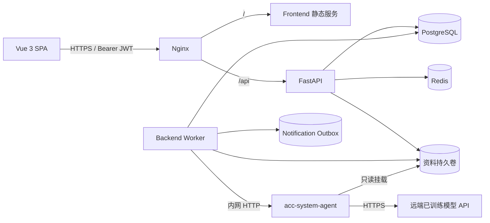
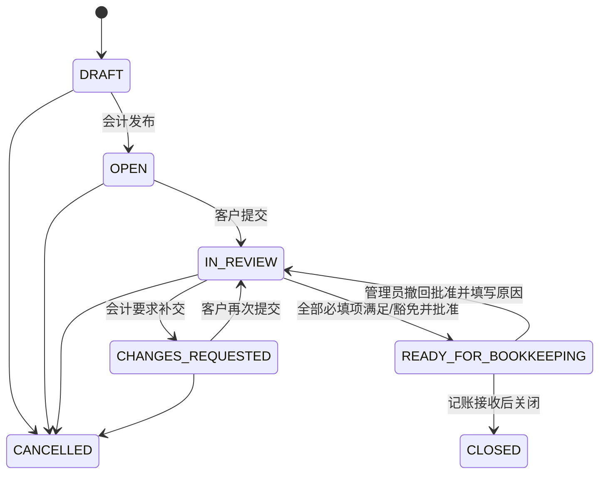

# 会计事务所资料收集系统 - 系统架构设计

## 1. 目标与范围

本系统服务于会计事务所的月度资料收集流程：客户经理创建收集请求，客户上传资料，会计人员审核并要求补交，直到该月份达到 `READY_FOR_BOOKKEEPING`。

MVP 必须完成：

- 事务所员工、客户联系人、角色与客户分配管理；
- 会计端创建、发布和跟踪月度资料收集请求；
- 客户端上传、查看问题、补交和再次提交；
- 单项资料审核、退回、豁免、整单批准和完整审计轨迹；
- Docker Compose 单机部署，以及前后端镜像通过 GitHub Actions 推送 Amazon ECR；
- 接入 `acc-system-agent` 完成上传分类和提交后审核；Agent 不直接修改业务状态，后端验证其输出后可按请求配置自动执行单项审核。

首版不做流程设计器、复杂模板系统、WebSocket、微服务拆分和对象存储抽象。单机容量或文件备份成为瓶颈时，再把文件迁移到 S3。

## 2. 从参考业务模型得到的系统约束

参考目录中的 12 类案例可以统一为“资料要求 + 证据 + 审核决定”模型，而不是为每类案例写一套程序。

1. 错主体、错期间、缺文件都不能满足资料要求；错误文件保留历史，不能物理删除。
2. 一份文件可能支持多个要求，一个要求也可能由多份文件共同支持，因此资料要求和文件是多对多关系。
3. 审核决定必须记录明确的 evidence 和 `SUPPORTS/CONTRADICTS/REFERENCE` 关系；AI 或人工都不得默认把本轮全部文件当成相同证据。
4. 客户可多轮补交；每轮提交、审核意见和状态变化都要保留。
5. 只有全部必填要求均为 `SATISFIED` 或 `WAIVED`，整单才能进入 `READY_FOR_BOOKKEEPING`。
6. F05 中“本次收款核对完成”不等于“全部款项已收齐”。整单完成状态必须描述核对范围，不能推导不存在的业务结论。
7. AI 输出必须由后端校验权限、证据归属、金额和置信度；高置信度未通过项自动退回客户，达到阈值的通过项可自动满足，但只有本轮全部通过后才允许会计人工确认整单；`WAIVED` 和整单批准始终由人工执行。

## 3. 总体架构



核心原则：

- FastAPI 是唯一业务入口和状态机所有者；
- PostgreSQL 是业务状态、审核记录和通知任务的唯一事实源；
- Redis 只保存可重建数据：JWT refresh session/revocation 和限流计数，不保存审批状态；
- Worker 与 API 使用同一个后端镜像，仅启动命令不同；
- 浏览器只能访问 Nginx，PostgreSQL、Redis、文件卷和内部 Worker 不暴露宿主机端口；
- `acc-system-agent` 是独立镜像，不连接 PostgreSQL/Redis，不拥有业务状态机；
- Agent 或远端模型故障时只影响自动分析，上传、人工审核和批准仍可继续。

## 4. 仓库职责

现有四个仓库继续使用，不增加基础设施仓库：

```text
acc-system-frontend/
  src/
  Dockerfile
  .github/workflows/build-image.yml

acc-system-backend/
  app/
  migrations/
  tests/
  Dockerfile
  pyproject.toml
  uv.lock
  deploy/
    compose.yml
    nginx/
      Dockerfile
      nginx.conf
  .github/workflows/build-image.yml

acc-system-agent/
  本地 AI Harness；读取只读资料卷、调用远端模型并规范化输出
  Dockerfile
  .github/workflows/build-image.yml

acc-system-docs/
  业务规则、接口说明、部署说明和测试样例
```

`deploy/` 放在后端仓库，因为数据库迁移、API、Worker 和 Compose 发布需要一起变更。Nginx 配置变化时单独构建 `acc-system-nginx` 镜像；Agent 由 `acc-system-agent` 自行构建并推送 ECR。

## 5. 角色与数据权限

MVP 使用四个固定角色，不实现自定义 RBAC 编辑器：

| 角色 | 权限 |
| --- | --- |
| `FIRM_ADMIN` | 管理事务所员工、客户、客户联系人和全部收集请求 |
| `ACCOUNTANT` | 访问被分配客户，创建请求、审核、退回和批准 |
| `CLIENT_ADMIN` | 管理本客户联系人，查看并提交本客户资料 |
| `CLIENT_SUBMITTER` | 查看并提交本客户资料 |

所有业务表都带有或可通过外键确定 `firm_id`。后端从已验证 JWT 取得当前用户和 `firm_id`，并重新查询当前成员关系，不接受请求体或查询参数传入的租户身份。客户用户只能通过 `client_members` 访问所属客户；会计人员通过 `client_assignments` 访问被分配客户。

MVP 一个用户账号只属于一个事务所，因此登录时可以确定唯一 `firm_id`；同一事务所内可关联多个客户。以后确有跨事务所顾问账号时，再增加显式的事务所选择/切换接口，不能让客户端任意改 JWT 中的 `firm_id`。

MVP 不同时维护一套 PostgreSQL Row Level Security 策略；统一授权依赖、租户过滤、复合外键和越权集成测试已经覆盖当前单应用入口。只有出现直接数据库访问、多套后端服务或监管要求时再增加 RLS，避免两套权限规则漂移。

如果以后需要“制单和复核必须由不同人员完成”，再增加 `REVIEWER` 角色和批准策略；首版不预埋流程引擎。

## 6. 核心状态机

### 6.1 收集请求



只有后端工作流服务可以执行迁移。每次迁移在同一数据库事务中完成以下动作：

1. `SELECT ... FOR UPDATE` 锁定收集请求；
2. 校验当前状态、操作者角色和完成条件；
3. 更新当前状态；
4. 写入不可变的 `workflow_events`；
5. 必要时写入 `notification_outbox`。

`FIRM_ADMIN` 可在尚未关闭时把 `READY_FOR_BOOKKEEPING` 撤回到 `IN_REVIEW`，且必须填写原因；`CLOSED` 是终态，关闭后的更正通过新建收集请求处理。取消同样必须填写原因，避免审核中的请求无法终止或无从追溯。取消记录不会删除，但不再占用“客户 + 期间”的唯一名额，因此可以为相同期间重新创建请求；任意时刻仍只允许一个未取消请求。

### 6.2 资料要求

| 状态 | 含义 |
| --- | --- |
| `PENDING` | 尚未收到可审核资料 |
| `RECEIVED` | 已收到资料，等待审核 |
| `NEEDS_ACTION` | 资料不合格或需说明，等待客户处理 |
| `SATISFIED` | 资料要求已满足 |
| `WAIVED` | 会计人员明确豁免，并填写原因 |

`NEEDS_ACTION` 搭配 `issue_code`：`MISSING`、`WRONG_PERIOD`、`ENTITY_MISMATCH`、`UNREADABLE`、`INCOMPLETE` 或 `OTHER`。状态和原因分开，避免为每个案例制造一套状态。

### 6.3 文件

```text
QUARANTINED -> AVAILABLE
QUARANTINED -> FAILED
QUARANTINED -> EXCLUDED
AVAILABLE   -> EXCLUDED
```

错误文件先保留为 `AVAILABLE` 并产生审核意见；只有客户确认传错或会计作出排除决定后才标记 `EXCLUDED`。原文件、校验值和历史记录不删除。

## 7. 数据模型

### 7.1 账户与客户

| 表 | 关键字段 |
| --- | --- |
| `firms` | `id`, `name`, `timezone`, `status` |
| `users` | `id`, `email`, `password_hash`, `name`, `status`, `last_login_at` |
| `firm_members` | `firm_id`, `user_id`, `role` |
| `clients` | `id`, `firm_id`, `code`, `legal_name`, `base_currency`, `features jsonb`, `status` |
| `client_bank_accounts` | `id`, `firm_id`, `client_id`, `bank`, `account_last4`, `currency`, `status` |
| `client_members` | `firm_id`, `client_id`, `user_id`, `role` |
| `client_assignments` | `firm_id`, `client_id`, `user_id` |
| `user_invites` | `id`, `firm_id`, `client_id`, `email`, `scope`, `role`, `token_hash`, `invited_by`, `expires_at`, `accepted_at`, `revoked_at` |

`clients.features` 保存 `uses_payment_platform`、`has_employee_reimbursement`、`has_loan`、`multi_currency`、`project_based`、`has_retention` 等业务特征。它们影响 AI/人工搜索资料的策略，但不能直接决定审核结果。

### 7.2 收集、提交与审核

| 表 | 关键字段 |
| --- | --- |
| `collection_requests` | `id`, `firm_id`, `client_id`, `period`, `due_at`, `status`, `scope_note`, `ai_mode`, `ai_satisfy_threshold`, `ai_request_action_threshold`, `version`, `created_by`, `submitted_at`, `approved_by`, `approved_at` |
| `requirements` | `id`, `firm_id`, `request_id`, `origin`, `type`, `analysis_type`, `title`, `required`, `criteria jsonb`, `status`, `issue_code`, `client_message`, `internal_note`, `version`, `reviewed_by`, `reviewed_at` |
| `submissions` | `id`, `firm_id`, `request_id`, `round_no`, `status`, `note`, `submitted_by`, `submitted_at` |
| `documents` | `id`, `firm_id`, `client_id`, `request_id`, `submission_id`, `storage_key`, `original_name`, `mime_type`, `size_bytes`, `sha256`, `document_type`, `entity_name`, `period`, `status`, `scan_error`, `attempts`, `next_attempt_at`, `locked_by`, `locked_until`, `extracted_data jsonb`, `uploaded_by`, `created_at` |
| `requirement_documents` | `firm_id`, `requirement_id`, `document_id`, `relation` |
| `review_decisions` | `id`, `firm_id`, `requirement_id`, `submission_id`, `decision`, `source`, `ai_run_id`, `issue_code`, `client_message`, `internal_note`, `created_by`, `created_at` |
| `workflow_events` | `id`, `firm_id`, `request_id`, `actor_type`, `actor_id`, `event_type`, `payload jsonb`, `created_at` |

说明：

- 一次客户补交对应一个 `submission`。每个请求同一时间最多一个 `DRAFT` submission；点击提交后变为 `SUBMITTED`，退回后下一轮创建新 submission。
- `requirements.origin` 区分创建请求时的 `INITIAL` 项和审核中新增的 `FOLLOW_UP` 项。已发布要求不删除，只能满足或豁免。
- `requirement_documents.relation` 使用 `SUPPORTS`、`CONTRADICTS`、`REFERENCE`，支持多发票对一笔付款、一张发票对多笔付款和报销证据链。
- `analysis_type` 固定为 `DOCUMENT_REQUIREMENT_VALIDATION | BANK_TRANSACTION_RECONCILIATION`，仅供 Backend/Agent 内部使用，不让会计选择。创建/新增/修改/复制时，银行对账单默认对账提示，其他资料默认要求校验；最终检查由提交后的 REVIEW 根据实际资料安排，不是互斥的两种业务流程。交易日期、描述、带符号金额和币种应从本次提交的对账单中提取，而不是在创建请求时手填。已有 `criteria.target_transaction` 保留历史，不作为新轮次的默认交易事实；复制请求不携带旧交易目标。
- 新请求默认 `AUTO_REVIEW` 且双阈值为 `0.980`；迁移前已有请求统一设为 `SUGGEST`，AI 策略只能在 `DRAFT` 修改。
- 上传分类确认后只写入 `document_type`；`entity_name`、`period` 和完整 `extracted_data` 只在客户提交后的 `REVIEW` 成功时写入。
- `review_decisions.source` 固定为 `HUMAN | AI`；`workflow_events.actor_type` 固定为 `USER | SYSTEM`，SYSTEM 事件允许 `actor_id` 为空。
- `review_decisions` 和 `workflow_events` 只追加，不更新历史；`requirements.status` 保存当前快照，方便查询。
- 对客户公开的 `client_message` 与仅事务所可见的 `internal_note` 分列保存；portal 使用独立响应模型，不能返回内部备注和 AI 原始输出。

### 7.3 AI 与通知

| 表 | 关键字段 |
| --- | --- |
| `ai_runs` | `id`, `firm_id`, `request_id`, `submission_id`, `purpose`, `status`, `model_version`, `input_snapshot jsonb`, `output jsonb`, `error`, `requested_by`, `attempts`, `next_attempt_at`, `locked_by`, `locked_until`, `created_at`, `finished_at` |
| `notification_outbox` | `id`, `firm_id`, `request_id`, `channel`, `recipient`, `template`, `payload jsonb`, `dedupe_key`, `status`, `attempts`, `next_attempt_at`, `locked_by`, `locked_until`, `last_error`, `sent_at` |
| `idempotency_records` | `id`, `firm_id`, `actor_id`, `key`, `method`, `path`, `request_hash`, `status`, `status_code`, `response_body jsonb`, `expires_at`, `created_at` |

关键数据库约束：

- `users.email` 使用大小写不敏感唯一索引；
- `clients (firm_id, code)` 唯一；
- `collection_requests (firm_id, client_id, period)` 对未取消记录使用部分唯一索引；取消记录保留且允许同期间重建；
- `submissions (request_id, round_no)` 唯一，并用部分唯一索引限制一个草稿轮次；
- 租户子表保留 `firm_id`，通过 `(firm_id, client_id)` 等复合外键阻止跨事务所关联，而不只依赖应用代码；
- 被复合外键引用的父表建立 `(firm_id, id)` 唯一约束，使租户一致性真正由 PostgreSQL 校验；
- `collection_requests.version`、`requirements.version` 非空并由 SQLAlchemy `version_id_col` 管理；
- `idempotency_records (firm_id, actor_id, key)` 唯一；同一 key 携带不同请求哈希时拒绝复用；
- `notification_outbox (firm_id, dedupe_key)` 唯一，`dedupe_key` 非空且由事件类型、请求和提醒周期稳定生成；
- 同一 `ai_run + requirement` 最多产生一条 AI 自动审核决定；
- 为请求看板 `(firm_id, status, due_at)`、客户资料 `(firm_id, client_id, period, document_type, created_at)`、任务领取 `(status, next_attempt_at)` 和事件查询 `(request_id, created_at)` 建索引；
- 金额使用 `numeric(20, 4)`，币种使用 ISO 4217 三字符代码；
- 时间戳使用 `timestamptz` 并存 UTC，月度期间使用当月第一天的 `date`；
- 业务状态使用文本列加 `CHECK`，避免 PostgreSQL enum 带来的迁移阻力。

## 8. 后端设计

技术栈：Python、uv、FastAPI、SQLAlchemy 2、Alembic、PostgreSQL、redis-py。先保持单体应用，不拆账户、收集、审核等微服务。

```text
app/
  main.py
  config.py
  db.py
  auth.py
  models.py
  schemas.py
  workflow.py
  storage.py
  worker.py
  api/
    auth.py
    users.py
    clients.py
    collection_requests.py
    documents.py
    reviews.py
  integrations/
    agent.py
```

`workflow.py` 集中保存状态迁移和完成条件；路由只做输入校验、授权和调用。首版不增加 repository/interface/factory 层。

后续如出现频繁的内部数据运维需求，可接入 SQLAdmin；只开放受限的基础数据维护，不允许直接修改收集请求、资料要求、审核决定和审计记录，避免绕过业务状态机。

### 8.1 开源实现审查与取舍

| 实现/官方文档 | 已验证的做法 | 本系统结论 |
| --- | --- | --- |
| [FastAPI Full Stack Template](https://github.com/fastapi/full-stack-fastapi-template) | FastAPI、PostgreSQL、Alembic、JWT、Docker Compose 和测试可在单体仓库内组合；当前用户和数据库会话通过依赖注入取得 | 保留模块化单体和集中认证依赖，不为每张表增加 repository/interface 层 |
| [OpenProject API v3](https://github.com/opf/openproject/blob/dev/docs/api/apiv3/example/README.md#updating-a-work-package) | 更新工作项必须带当前 `lockVersion`，更新成功后版本递增，避免旧页面静默覆盖新修改 | 为请求和资料要求增加乐观版本；版本冲突返回 `409 CONFLICT` |
| [SQLAlchemy Version Counter](https://docs.sqlalchemy.org/en/20/orm/versioning.html) | `version_id_col` 在 ORM 更新/删除时检查内存版本与数据库版本，并在陈旧时抛出 `StaleDataError` | 直接使用 SQLAlchemy 内建版本列，不自制并发框架；批量 UPDATE 不用于受版本保护的工作流实体 |
| [Paperless-ngx API](https://github.com/paperless-ngx/paperless-ngx/blob/dev/docs/api.md#file-uploads) / [Usage](https://github.com/paperless-ngx/paperless-ngx/blob/dev/docs/usage.md) | 上传后异步处理、原件保留、任务状态可查询，并保存文档历史；其 Celery/Redis 适合更重的 OCR 流程 | 采用隔离区、不可变原件、异步状态和历史；首版任务量小，继续用 PostgreSQL 队列，不引入 Celery |
| [PostgreSQL SELECT](https://www.postgresql.org/docs/current/sql-select.html) | `FOR UPDATE SKIP LOCKED` 适合多个消费者处理队列表，但结果要有确定排序 | Worker 以短事务领取带租约的任务，外部 I/O 不占用行锁 |
| [Nginx internal](https://nginx.org/en/docs/http/ngx_http_core_module.html#internal) | `internal` location 拒绝外部直接访问，但可由上游通过 `X-Accel-Redirect` 内部跳转 | FastAPI 完成授权后让 Nginx 发送文件，避免 Python 进程搬运大文件 |

这次审查不建议改成微服务、消息中间件、通用流程引擎或对象存储抽象。当前规模下，它们不会修复业务正确性，反而增加部署和故障点。

### 8.2 认证

- 用户名密码登录，密码使用 Argon2id 哈希；
- 登录成功返回短期 access JWT；前端只保存在 Pinia 内存中，并通过 `Authorization: Bearer <token>` 发送；
- refresh JWT 使用 `HttpOnly + Secure + SameSite=Strict` Cookie，前端 JavaScript 不读取；
- access JWT 建议 15 分钟过期，refresh JWT 建议 7 天过期并在每次刷新时轮换；
- JWT 至少包含 `sub`、`sid`、`firm_id`、`type`、`iat`、`exp`、`jti`、`iss`、`aud`，后端固定签名算法白名单，不信任 token header 自报算法；
- Redis 以 `sid` 保存 refresh session 和当前 `jti`，登出、禁用账号或密码修改时删除 session，使 refresh token 立即失效；
- 受保护接口验证 JWT 后还要确认 `sid` 仍存在；Redis 不可用时认证失败而不是绕过撤销检查；
- 角色与客户权限不直接相信 JWT 内的陈旧声明，后端仍查询当前成员关系；
- 使用统一的 `current_principal` 依赖完成用户、成员关系和客户范围校验；所有按 id 查询都先限定 `firm_id`/`client_id`，防止 IDOR；
- refresh/logout 接口校验 `Origin`，Cookie 仅限定到认证路径；
- 登录、邀请接受和密码重置按 IP 与账号限流；
- 邀请/重置 token 只保存哈希并设置过期时间；
- 密码重置申请无论账号是否存在都返回相同响应；确认 token 只能使用一次，成功后撤销该用户全部 refresh session；
- Nginx 与前端同域，因此生产环境不开放宽泛 CORS。

该实现遵循 FastAPI 官方的 OAuth2 Bearer + JWT 基础模式，但增加 refresh 轮换和服务端撤销能力；官方示例见 [OAuth2 with Password and JWT](https://fastapi.tiangolo.com/tutorial/security/oauth2-jwt/)。

### 8.3 文件存储与安全

MVP 将文件保存到后端持久卷 `/data/documents`，`storage_key` 使用不可猜测 UUID 路径，不使用客户原始文件名。原始文件不可覆盖；业务上的“删除”只改变状态并保留审计记录。

上传流程固定为：

1. 使用 FastAPI `UploadFile` 分块写入 `/data/quarantine/<upload_id>.part`，边写边限制总字节并计算 SHA-256，不能把整个文件读入内存；
2. 校验扩展名、声明 MIME 和 magic bytes，并原子重命名为隔离区文件；
3. 在数据库写入 `QUARANTINED` 文档记录，接口返回 `202`、document id 和处理状态；
4. Worker 扫描通过后原子移动到最终 UUID 路径并标记 `AVAILABLE`，失败则标记 `FAILED`；重试时若最终文件已存在且哈希一致，直接补写状态，使崩溃恢复具备幂等性；过期 `.part` 和无数据库引用的孤儿文件由定时清理任务删除。

同一事务所、同一客户内完全相同 SHA-256 的文件默认提示重复并关联已有证据，不直接拒绝，因为同一文件可能合法支持多个要求；绝不跨事务所复用文件。生产 Compose 可加入 ClamAV 容器；内测环境若暂不启用扫描，不应允许用户下载原文件或交给 AI。

下载接口先校验事务所和客户权限，再返回 `X-Accel-Redirect`；Nginx 的文件 location 标记为 `internal`，不得直接公开资料目录。预览只对安全转换后的 PDF/图片开放，不在浏览器中内联执行用户上传的 HTML/SVG。

当需要多台 API 服务器、跨机容灾或文件量明显增长时，再迁移 S3。届时只替换 `storage.py` 的读写点，并保持数据库 `storage_key` 和下载 API 不变。

### 8.4 事务、并发与幂等

- 发布、提交、退回、批准、撤回批准和关闭接口接收 `Idempotency-Key`；服务端先以唯一约束占用 key，再保存 actor、路径、请求哈希和小型响应。同 key 同请求重放原响应，同 key 不同请求返回 `409`；并发中的同 key 请求返回可重试冲突，记录按保留期清理；
- 修改请求或资料要求时提交当前 `version`。SQLAlchemy 版本不匹配时返回 `409` 和最新资源，要求用户刷新，不允许最后写入者静默覆盖前一人的审核；
- 状态迁移仍使用 `SELECT ... FOR UPDATE` 锁定 `collection_requests`，并统一按“请求 → 要求 → 文档”的顺序加锁，防止批准与单项审核同时越过完成条件，也降低死锁风险；
- `workflow_events`、当前状态和 outbox 必须在同一事务提交；审计事件没有更新/删除接口；
- 通知采用 transactional outbox，与业务状态在同一事务写入，避免状态已变但消息丢失。

Worker 领取规则：按 `next_attempt_at, id` 排序，在短事务中以 `FOR UPDATE SKIP LOCKED` 取得任务，写入 `PROCESSING + locked_by + locked_until` 后立即提交；Agent HTTP 和未来通知渠道调用在事务外执行，结果再用短事务回写。进程崩溃后，过期租约可被其他 Worker 重领；超过最大次数进入 `FAILED` 并告警。不要在等待外部服务时持有数据库行锁。

## 9. API 设计

统一前缀 `/api/v1`，错误结构为 `{ code, message, details, request_id }`。列表接口统一使用游标或 `page/page_size`，MVP 可先使用分页。

### 9.1 登录与账户

```text
POST   /auth/login
POST   /auth/refresh
POST   /auth/logout
GET    /me
PATCH  /me/password
POST   /auth/invitations/accept
POST   /auth/password-reset/request
POST   /auth/password-reset/confirm

GET    /users
POST   /users/invitations
PATCH  /users/{user_id}

GET    /clients
POST   /clients
GET    /clients/{client_id}
PATCH  /clients/{client_id}
GET    /clients/{client_id}/documents?period=&document_type=
GET    /clients/{client_id}/members
PATCH  /clients/{client_id}/members/{user_id}
PUT    /clients/{client_id}/assignments
POST   /clients/{client_id}/invitations
```

### 9.2 收集请求

```text
GET    /collection-requests
POST   /collection-requests
GET    /collection-requests/{request_id}
PATCH  /collection-requests/{request_id}          # 仅 DRAFT
POST   /collection-requests/{request_id}/publish
POST   /collection-requests/{request_id}/cancel
POST   /collection-requests/{request_id}/requirements
GET    /collection-requests/{request_id}/events
```

创建接口在一个事务中接收请求头信息和 `requirements[]`。月度重复需求先提供“复制上月请求”动作，不建设模板编辑器：

```text
POST /collection-requests/{request_id}/copy?period=2026-09
```

新增要求在 `DRAFT` 中可直接编辑；审核中新增 `FOLLOW_UP` 要求时，后端同时把整单迁移到 `CHANGES_REQUESTED` 并记录事件。已发布要求不得物理删除。

### 9.3 客户上传与提交

```text
GET    /portal/collection-requests
GET    /portal/collection-requests/{request_id}
POST   /portal/collection-requests/{request_id}/classification-runs
POST   /portal/collection-requests/{request_id}/documents
DELETE /portal/documents/{document_id}             # 仅草稿且未提交；逻辑排除
POST   /portal/ai-runs/{run_id}/start
GET    /portal/ai-runs/{run_id}
POST   /portal/ai-runs/{run_id}/confirm
POST   /portal/ai-runs/{run_id}/cancel
POST   /portal/collection-requests/{request_id}/submit

GET    /documents/{document_id}
GET    /documents/{document_id}/download
GET    /documents/{document_id}/preview
```

文件上传使用标准 `multipart/form-data`，受理后返回 `202 Accepted`；前端轮询文档详情直到 `AVAILABLE` 或 `FAILED`。批量分类的文件在确认前不进入正式清单；`OTHER` 进入其他资料，`INVALID` 和取消的文件逻辑排除。全部 HTTP 请求统一经过 Axios 实例，上传进度使用 `onUploadProgress`。

### 9.4 审核

```text
POST /requirements/{requirement_id}/review
POST /collection-requests/{request_id}/request-changes
POST /collection-requests/{request_id}/approve
POST /collection-requests/{request_id}/reopen
POST /collection-requests/{request_id}/close
POST /collection-requests/{request_id}/ai-runs
GET  /ai-runs/{run_id}
POST /ai-runs/{run_id}/retry
```

单项审核 `decision` 为 `SATISFY`、`REQUEST_ACTION` 或 `WAIVE`，并显式提交 evidence 及其关系。`REQUEST_ACTION` 必须有 `issue_code` 和面向客户的明确说明；`WAIVE` 必须有原因且永远不由 AI 自动执行。整单批准接口再次检查所有必填项，AI 不得自动进入 `READY_FOR_BOOKKEEPING`。所有修改状态的请求携带当前 `version`；发布、提交、退回、批准、撤回批准和关闭同时携带 `Idempotency-Key`。

## 10. AI 接口边界

### 10.1 两阶段处理

上传阶段只做最小分类：

```text
完整文件上传 → 安全扫描 → CLASSIFY run → 返回资料类别 → 客户确认/拖动调整
```

`CLASSIFY` 只能返回 `REQUIREMENT | OTHER | INVALID`、`document_type`、`requirement_id` 和 `confidence`。此阶段不检查主体、期间和金额，不持久化完整提取字段，不搜索历史资料，不产生审核决定，也不修改 requirement/collection 状态。只有客户显式确认合入后，Backend 才按普通人工上传的规则关联文件并将待收集项标为 `RECEIVED`；这不是 AI 审核决定。

首批本地功能（B6.2/A2/F7.1/F7.2）用 `AGENT_CLASSIFICATION_PROVIDER=MOCK` 验证交互，页面必须显示模拟标识，生产禁用 MOCK。分类 run 的成功/失败与用户确认分开：`confirmed_at` 和 `confirmation` 保存幂等合入结果。取消不会关联暂存文件；扫描后可改为手动分类。远端模型未提供协议及凭据前，不宣称分类准确率或真实模型联调完成。

客户正式提交后再执行完整审核：

```text
提交 → IN_REVIEW → REVIEW run → 字段提取 → 当前/历史资料搜索 → 证据与金额核对 → 任一项未通过则自动退回客户 → 全部通过后等待会计确认整单
```

### 10.2 Backend-Agent 协议

Backend-Agent 线上 JSON 统一使用 `snake_case`；前端仍只在 Axios 边界转换为 `camelCase`。`acc-system-agent` 不连接主数据库、不直接发通知、不修改业务状态。Backend Worker 通过内网 HTTP 调用：

```http
POST /v1/analyze
Idempotency-Key: <ai_run_id>:<turn>
```

请求的 `purpose` 固定为 `CLASSIFY | REVIEW`。Backend 只发送文档引用，Agent 在只读资料卷中验证路径和 SHA-256 后读取完整文件：

```json
{
  "schema_version": "1",
  "run_id": "uuid",
  "purpose": "REVIEW",
  "turn": 0,
  "context": {
    "entity_name": "Alpha Consulting Pte. Ltd.",
    "period": "2026-08-01",
    "submission_id": "uuid"
  },
  "requirements": [
    {
      "id": "uuid",
      "analysis_type": "DOCUMENT_REQUIREMENT_VALIDATION",
      "document_type": "BANK_STATEMENT",
      "title": "UOB bank statement",
      "required": true,
      "instructions": "Full statement for the requested period"
    }
  ],
  "documents": [
    {
      "document_id": "uuid",
      "storage_key": "firm/client/uuid",
      "content_type": "application/pdf",
      "sha256": "64-character-lowercase-hex",
      "original_name": "statement.pdf",
      "requirement_ids": ["uuid"],
      "scope": "CURRENT"
    }
  ],
  "search_history": []
}
```

`CLASSIFY` 响应只包含分类结果；`REVIEW` 响应可包含提取字段、findings、evidence、面向客户的补交消息和结构化金额关系：

```json
{
  "schema_version": "1",
  "run_id": "uuid",
  "model_version": "model-v1",
  "search": null,
  "extractions": [{"document_id": "uuid", "entity_name": "Alpha Consulting Pte. Ltd.", "period": "2026-07-01"}],
  "findings": [
    {
      "requirement_id": "uuid",
      "action": "ASK_CLIENT",
      "suggested_decision": "REQUEST_ACTION",
      "issue_code": "WRONG_PERIOD",
      "confidence": 0.99,
      "entity_check": "MATCH",
      "period_check": "MISMATCH",
      "explanation": "The statement covers July, but August was requested.",
      "evidence": [{"document_id": "uuid", "relation": "CONTRADICTS", "reason": "The period on the statement differs from the request."}],
      "amounts": [],
      "client_message": "Please upload the statement for the requested period."
    }
  ]
}
```

`REVIEW` 动作固定为 `SEARCH_CURRENT | SEARCH_HISTORY | ASK_CLIENT | RESOLVE | ESCALATE`，最多执行三轮搜索。Backend 必须校验 schema、run id、租户/客户证据归属和枚举值；金额使用十进制字符串传输并用 `Decimal` 重算。达到阈值的 `REQUEST_ACTION` 自动执行并将整单转为 `CHANGES_REQUESTED`，达到阈值的 `SATISFY` 自动满足单项；只有本轮全部通过且所有资料项完成后，才允许会计人工批准整单。低置信度、非法证据、计算不一致或 `ESCALATE` 转人工。

搜索轮响应的 `findings` 必须为空，`search` 包含 `action`、`requirement_id` 以及可选 `document_type/period/query/amount/currency`；Backend 执行租户/客户限定搜索并增加下一轮输入。最终结果必须覆盖每个输入文件和资料项。金额关系使用 `SUM/SUBTRACT/MULTIPLY`，每个 operand 为 `{document_id, amount, label}`，强制关联证据。实际严格定义见 Backend/Agent 同步的 `app/analysis_schemas.py`。

**当前实现边界（B6.4/F7.3，2026-09-23，待用户验收）**：已接通提交后分析、最多三轮搜索、证据验证、Decimal 重算、高置信度问题自动退回、通过项自动满足和整轮人工确认、人工显式 evidence 与 `SUPPRESSED` Outbox。`SUGGEST` 只保存建议，`OFF` 不创建 REVIEW；豁免和整单批准保持人工。开发环境使用 `AGENT_REVIEW_PROVIDER=MOCK` 固定案例，生产禁止模拟；真实模型协议尚待提供，不能把模拟结果当作文件真实提取或模型准确率验证。

## 11. 前端设计

技术栈使用 Vue 3、TypeScript、Vite、shadcn-vue、Pinia、Vue Router、Vue I18n、Axios 和 `axios-case-converter`。Pinia 只保存认证状态和少量 UI 偏好；服务端业务数据按页面请求，避免再造客户端数据库。

### 11.1 开源实现调研与取舍

前端流程不是凭空设计，以下结论来自开源项目的官方文档和源码：

| 项目 | 已验证的实现 | 本系统采用的部分 |
| --- | --- | --- |
| [OpenProject](https://www.openproject.org/docs/user-guide/work-packages/work-package-views/) | 工作项使用可筛选表格、右侧 split-screen 详情和完整详情页；[Activity](https://www.openproject.org/docs/user-guide/activity/) 把评论和字段变更放在同一时间线；[Workflow](https://www.openproject.org/docs/system-admin-guide/manage-work-packages/work-package-types/workflows/) 按角色限制允许的状态迁移 | 收集请求列表 + 右侧详情、独立审核页、活动时间线、只显示当前用户可执行的动作 |
| [ERPNext / Frappe](https://docs.frappe.io/erpnext/workflow-actions) | Workflow Actions 提供集中待办列表，用户从待办进入单据并执行允许的批准/拒绝动作；[Workflow](https://docs.frappe.io/erpnext/workflows) 支持角色和多级审批 | 首页提供“待我处理”；审核按钮使用业务动作名称，不让用户直接编辑状态字段 |
| [Paperless-ngx](https://github.com/paperless-ngx/paperless-ngx/blob/dev/docs/usage.md) | 文档列表是主要入口，支持元数据筛选；详情页集中展示文件预览、元数据、版本和历史；上传后的处理流程与文档业务状态分开 | 审核页集中展示原文件、提取字段、处理状态和历史；`QUARANTINED/FAILED` 不与审批状态混用 |
| [n8n](https://github.com/n8n-io/n8n/blob/master/CONTRIBUTING.md) | Vue 工作流编辑器、设计系统、执行核心和 workflow 类型被拆为多个专门模块，服务于用户自由创建节点和连线 | 不采用画布。当前审批状态固定，用普通列表、详情和动作按钮即可 |

因此 MVP 不做流程画布、拖拽节点、状态转换矩阵、看板和自定义视图编辑器。它们解决的是“用户自行设计流程”，而本系统解决的是“用户高效执行固定资料收集流程”。

### 11.2 页面与交互结构

主要页面：

```text
/login
/app/dashboard
/app/clients
/app/clients/:id
/app/collections
/app/collections/new
/app/collections/:id
/app/collections/:id/review
/app/admin/users

/portal/collections
/portal/collections/:id
```

会计端：

- `/app/dashboard` 默认显示 `待我审核`、`等待客户`、`即将到期`、`已逾期` 四个队列和数量；
- `/app/collections` 使用服务端分页表格，固定筛选项为客户、期间、状态、负责人、截止日期；筛选条件写入 URL query，返回列表时不丢失；
- 桌面端点击表格行先打开右侧详情面板，支持继续打开完整页面；窄屏直接进入完整页面；
- `/app/collections/:id/review` 使用三块区域：左侧资料要求列表，中间文件预览/提取字段，右侧审核动作与 AI 结果；活动时间线统一位于请求详情页；
- 只展示当前状态和权限允许的业务动作，例如“发布”“要求补交”“批准进入记账”“关闭”，不提供任意状态下拉框；
- 创建请求时配置 AI 模式、通过建议阈值和自动退回阈值；上传阶段只显示类别、目标资料项和置信度，不提前显示审核结论；
- 提交后的 AI 自动决定使用独立视觉标识，展示模型版本、证据、提取字段、金额关系和转人工原因；会计可追加人工决定覆盖 AI 结果。

客户端：

- 请求详情顶部显示期间、截止日、负责人和整体进度；
- 每个 requirement 是一个可展开条目，明确展示需要的资料、已上传文件、审核结果和补交原因；
- 上传区绑定具体 requirement，并同时提供“其他支持文件”；
- 页面底部固定主动作“提交审核/再次提交”，提交前列出仍未上传或仍需处理的必填项；
- 客户只能看到对客户公开的审核意见，事务所内部备注与 AI 原始输出不返回到 portal API。

状态既显示文字和图标，也可显示颜色，但不能只靠颜色表达。破坏性动作、豁免和最终批准需要确认弹窗；普通单项审核不重复弹窗。

### 11.3 Axios、JWT 与字段命名

前后端命名约定固定为：

- FastAPI/Pydantic 请求响应与数据库字段使用 `snake_case`；
- Vue/TypeScript 变量、类型属性和组件 props 使用 `camelCase`；
- 只在统一 Axios 实例边界转换，不允许页面组件手写字段映射。

使用 [`axios-case-converter`](https://github.com/mpyw/axios-case-converter) 包装 `axios.create()`：请求 `data` 和 `params` 递归转为 `snake_case`，响应 `data` 递归转为 `camelCase`；设置 `ignoreHeaders: true`，避免改写 `Authorization`、`Idempotency-Key` 等协议头。该库本身就是 Axios transformer/interceptor，Axios 官方也支持在自定义实例上安装 request/response interceptor，见 [Axios Interceptors](https://github.com/axios/axios-docs/blob/master/posts/en/interceptors.md)。

```ts
const api = applyCaseMiddleware(
  axios.create({ baseURL: '/api/v1', withCredentials: true }),
  { ignoreHeaders: true },
)
```

Axios request interceptor 从 auth store 读取 access JWT 并设置 Bearer header。Response interceptor 遇到 access token 过期时使用一个共享 refresh Promise，确保并发 401 只调用一次 `/auth/refresh`；刷新成功后原请求最多重试一次，刷新失败则清空 store 并跳转登录页。登录、refresh 请求本身不进入重试循环。

Access JWT 只保存在 Pinia 内存，不写 `localStorage` 或 `sessionStorage`。应用重新打开时调用 `/auth/refresh`，依靠 HttpOnly refresh Cookie 恢复登录。

字段转换需要留下一个前端单测，至少覆盖嵌套对象、数组、query params、`FormData/File` 不被破坏、错误响应和下载 `Blob`。如果以后必须传递键名不可修改的第三方原始 JSON，使用 `preservedKeys` 或独立的 raw Axios client，不在组件里绕过约定。

### 11.4 前端目录与状态管理

建议目录：

```text
src/
  api/client.ts
  api/auth.ts
  api/collections.ts
  i18n/index.ts
  locales/en.ts
  locales/zh-CN.ts
  router/index.ts
  stores/auth.ts
  stores/ui.ts
  domain/status.ts
  views/accounting/
  views/portal/
  views/admin/
  components/ui/          # shadcn-vue 生成组件
  components/collections/
    CollectionTable.vue
    CollectionDetailPanel.vue
    RequirementList.vue
    DocumentViewer.vue
    ReviewDecisionPanel.vue
    ActivityTimeline.vue
```

状态归属：

- Pinia `auth`：access JWT、当前用户、当前 firm；
- Pinia `ui`：侧栏折叠、详情面板等跨页面 UI 偏好；
- URL query：列表筛选、分页和排序；
- 页面组件：请求详情、requirements、documents 和 review 数据；
- `domain/status.ts`：状态文字、图标、颜色和允许显示的动作映射；
- 后端：所有权限和状态迁移的最终判断。

前端共同约束：

- 路由守卫只改善体验，真正权限仍由后端校验；
- 上传、退回、批准操作有明确 loading、失败和重复点击保护；
- 基本键盘操作、label、焦点和错误提示不能省略。

### 11.5 国际化

前端使用 Vue I18n。`en` 是源语言、默认 locale 和 fallback locale，`zh-CN` 是简体中文可选语言。用户可见的页面文案、表单校验、状态名称和错误提示都使用翻译 key，不在组件中硬编码。

新浏览器或没有已保存偏好的用户始终显示英文，不根据浏览器语言自动切换。用户主动选择语言后，只把 locale 保存到本地偏好，并同步更新根元素的 `lang` 属性；access JWT 等认证信息仍不得写入浏览器存储。日期、时间、金额和数字使用 Vue I18n/`Intl` 的 locale 格式化能力，不手工拼接语言相关格式。

后端继续返回稳定的错误 `code`、枚举值和结构化参数，前端将它们映射到翻译 key；API 字段名、枚举值、日志和审计数据不做翻译。`zh-CN` 缺失消息时回退到英文，生产界面不得显示原始翻译 key。MVP 直接打包两种语言，不增加按语言拆包，直到包体测量证明有必要。

## 12. 通知接口

通知不是审批状态的驱动者，只消费领域事件。以下事件写入 outbox：

- `REQUEST_PUBLISHED`
- `DUE_SOON`
- `OVERDUE`
- `CHANGES_REQUESTED`
- `READY_FOR_BOOKKEEPING`

Worker 按第 8.4 节的租约规则领取任务，失败后指数退避。`dedupe_key` 建唯一索引，防止定时任务或重试重复催办；发送前再次检查请求状态，请求进入 `IN_REVIEW`、`READY_FOR_BOOKKEEPING`、`CLOSED` 或 `CANCELLED` 后不再发送客户催办。

Outbox 提供的是“至少一次”投递：如果外部渠道发送成功后 Worker 在回写前崩溃，邮件仍可能重复。`dedupe_key` 负责防止重复创建任务；渠道支持幂等键时继续透传。首版不为追求不可能的跨系统原子提交引入消息中间件，页面中的请求状态始终是最终依据。

首版只建立 Outbox，`NOTIFICATION_DELIVERY_ENABLED=false`。自动要求补交时，为该客户所有有效 `CLIENT_ADMIN/CLIENT_SUBMITTER` 按邮箱去重创建 `SUPPRESSED` 记录，原因为 `PROVIDER_DISABLED`；将来启用渠道时不补发旧记录。Email/SES 或飞书出现明确上线需求时，再实现相同的最小调用约定：

```python
send(recipient: str, template: str, payload: dict) -> None
```

邀请通知不可用时，管理员页面仍可复制一次性邀请链接，因此通知服务故障不会阻断账户创建。

## 13. Docker 与部署

### 13.1 镜像

| Compose 服务 | 镜像来源 | 说明 |
| --- | --- | --- |
| `nginx` | ECR `acc-system-nginx` | TLS 后的统一入口与反向代理 |
| `frontend` | ECR `acc-system-frontend` | 当前 Dockerfile 的静态 Web Server 可继续使用 |
| `backend` | ECR `acc-system-backend` | FastAPI API |
| `worker` | 同一个 backend 镜像 | 仅覆盖启动命令，不重复构建镜像 |
| `migrate` | 同一个 backend 镜像 | 一次性执行 `uv run alembic upgrade head` |
| `agent` | ECR `acc-system-agent` | 本地 AI Harness，读取只读资料卷并调用远端模型 |
| `postgres` | 官方 PostgreSQL 固定版本/摘要 | 使用独立持久卷，不重打无变化的自定义镜像 |
| `redis` | 官方 Redis 固定版本/摘要 | JWT refresh session、撤销和限流；仅内网访问 |
| `clamav` | 官方镜像，可按环境启用 | 上传文件恶意内容扫描 |

数据库和 Redis 已经分别是独立 Docker image。除非确实需要扩展或初始化脚本，不复制官方 Dockerfile，也不推送同内容镜像到 ECR。

Compose 通过 `AGENT_IMAGE` 固定 Agent 镜像 SHA；Backend/Worker 使用 `AGENT_URL=http://agent:8000`，Agent 使用 `MODEL_API_URL`、`MODEL_HEALTH_URL`、`MODEL_API_KEY`、`MODEL_CONNECT_TIMEOUT_SECONDS`、`MODEL_REQUEST_TIMEOUT_SECONDS` 和 `DOCUMENT_PATH=/data/documents`。`MODEL_HEALTH_URL` 显式指定只读健康探针地址，不用推理请求做健康检查；真实模型协议未提供前，健康响应约定仅用于基线测试。Agent live 与 ready 分离，模型未配置不会阻止人工业务服务启动。

### 13.2 Compose 约束

- 仅 `nginx` 映射宿主机 `80/443`；
- `frontend`、`backend`、`worker`、`agent`、`postgres`、`redis` 在 internal network；
- PostgreSQL、资料目录和证书使用命名卷或明确的宿主机目录；
- backend/worker 对资料卷读写，Nginx 只读挂载最终资料目录并仅通过 `internal` location 提供文件；隔离区不挂载给 Nginx；
- agent 只读挂载最终资料目录，不映射宿主机端口，不挂载数据库或 Redis 凭据；
- `backend` 在 `migrate` 成功后启动，并等待 PostgreSQL/Redis healthcheck；
- Nginx 将 `/api/` 转发到 backend，将其他路径转发到 frontend；
- Nginx 和 FastAPI 都配置上传大小与超时，二者限制保持一致；
- `/api/v1/health/live` 只检查进程，`/api/v1/health/ready` 检查 PostgreSQL 和 Redis；
- 生产 `.env` 只保存在服务器，数据库密码、JWT 签名密钥、AWS、`MODEL_API_KEY` 不进入镜像或 Git。

### 13.3 GitHub Actions 与 ECR

前端、后端和 Agent 仓库各自独立发布：

1. push/PR 先执行测试与构建；
2. 仅 `main` 或 release tag 使用 GitHub OIDC 获取 AWS 临时凭证；
3. 使用 BuildKit 构建并缓存层；
4. 推送 `<git-sha>` 不可变标签，同时更新 `main` 标签；
5. 服务器 `.env` 固定前端、后端和 Agent 的 SHA 标签，避免 `latest` 导致不可复现部署。

服务器发布命令保持简单：

```bash
docker compose --env-file .env.prod pull
docker compose --env-file .env.prod run --rm migrate
docker compose --env-file .env.prod up -d --remove-orphans
```

CI 只构建和推送，不直接 SSH 生产服务器。需要自动部署时，再增加受保护环境审批后的部署 job。

## 14. 运维与安全基线

- JSON 结构化日志包含 `request_id`、`actor_id`、`firm_id`、资源 id，不记录密码、JWT、refresh Cookie、文件内容或 AI 原文敏感字段；
- 所有登录、下载、上传、审核和权限变更写审计事件；
- PostgreSQL 每日备份并定期验证恢复，资料卷做加密快照/异地备份；
- TLS、安全响应头和上传限速由 Nginx 统一配置；refresh Cookie 必须启用 `Secure`、`HttpOnly` 和严格的 Path/SameSite；
- 文件下载使用授权检查和 `Content-Disposition: attachment`，不在浏览器内执行不可信 HTML/SVG；
- 对外响应使用明确的 Pydantic response model，不直接序列化 ORM 对象；portal 模型中不存在 `internal_note`、AI 原始输出和其他事务所字段；
- 数据库迁移先向后兼容，再发布应用；破坏性字段删除放到后续版本；
- 告警至少覆盖 API 不可用、Worker 积压、AI 连续失败、磁盘空间和备份失败。

## 15. 最小验收场景

1. 管理员邀请会计和客户联系人；越权访问其他事务所/客户返回 404 或 403。
2. 会计创建并发布 2026-08 请求，客户收到入口并上传资料。
3. 客户批量上传文件；`CLASSIFY` 只返回资料类别，客户可拖动调整，确认前不进入正式清单。
4. 客户提交错主体/错期间文件后才启动 `REVIEW`；达到阈值时自动标记 `NEEDS_ACTION` 并把整单退回客户，文件和决定历史仍保留。
5. 客户上传正确文件，会计将要求标为 `SATISFIED` 并批准，整单进入 `READY_FOR_BOOKKEEPING`。
6. B01/B02/F02 等场景可把多份文件关联到同一要求；B03 可经授权搜索关联历史期间证据。
7. 任一必填要求未满足时，批准接口必须失败，即使前端或 AI 请求批准。
8. Agent/远端模型停机时，上传、手动分类、人工审核和批准仍然可用；失败任务可恢复重试。
9. access JWT 过期时，并发请求只触发一次 refresh；登出后旧 refresh JWT 和同一 `sid` 的 access JWT 均不可继续使用。
10. Axios 字段转换测试覆盖嵌套对象、数组、query、错误响应、上传 `File` 和下载 `Blob`。
11. 两个会计打开同一要求时，后提交的旧版本收到 `409`；批准与单项退回并发时不能错误进入 `READY_FOR_BOOKKEEPING`。
12. Worker 在领取任务后被终止，租约过期后任务可重试；同一 AI run 不重复产生自动决定，同一 `dedupe_key` 只存在一条 Outbox 记录。
13. 文件在扫描完成前不可下载；扫描成功后只能通过已授权的下载接口访问，直接请求 Nginx 内部路径返回拒绝。
14. portal 响应不包含内部备注和 AI 原始输出；猜测其他事务所的资源 id 无法读取或关联。
15. 相同 `Idempotency-Key` 和相同请求返回原结果；同 key 不同请求返回 `409`。

## 16. 实施顺序

1. B1 + F1：后端、前端和 Nginx 镜像，迁移、Compose、健康检查与 ECR 发布；
2. B2 + F2：JWT 登录/刷新/撤销、统一 Axios、Vue I18n（默认英文）、应用布局与租户权限；
3. F3：基于 B2 完成员工、客户、联系人和客户分配页面；
4. B3 + F4：收集请求、资料要求、Dashboard、列表、发布与事件；
5. B4 + F5：文件隔离处理、客户门户与首次提交；
6. B5 + F6：多轮补交、证据关联、审核状态机和 `READY_FOR_BOOKKEEPING` 完成条件；
7. B6.1 + A1：AI 数据模型、Agent 服务基线和 Compose/ECR 部署；
8. B6.2 + A2 + F7.1/F7.2：请求 AI 策略、完整文件的上传快速分类与客户确认；
9. B6.3 + A3 + F7.3：客户提交后的完整审核、当前/历史搜索和证据关系；
10. B6.4 + F7.3：问题自动退回、通过项自动满足、整轮人工确认、Outbox 和综合验收。

第 6 步完成后，即使关闭 AI 和消息渠道，系统也已经具备账户、收集、提交、退回、补交和批准的完整人工业务闭环。

## 17. 开发执行文档

- [后端开发文档](./README_后端开发文档.md)：B1-B6 的交付内容、阶段验收场景和完成标准；
- [前端开发文档](./README_前端开发文档.md)：F1-F7 的页面交付、接口依赖、阶段验收场景和完成标准；
- [Agent 开发文档](./README_Agent开发文档.md)：A1-A3 的服务基线、快速分类、完整审核和验收场景。
