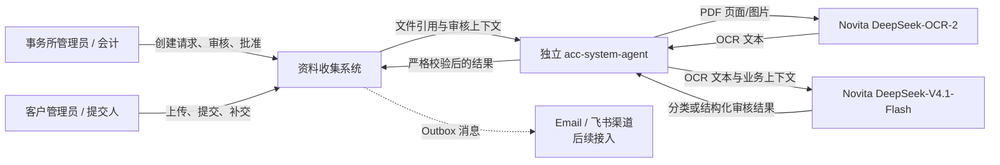
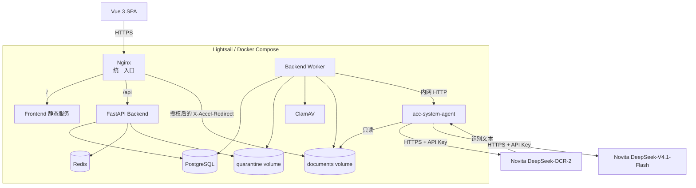
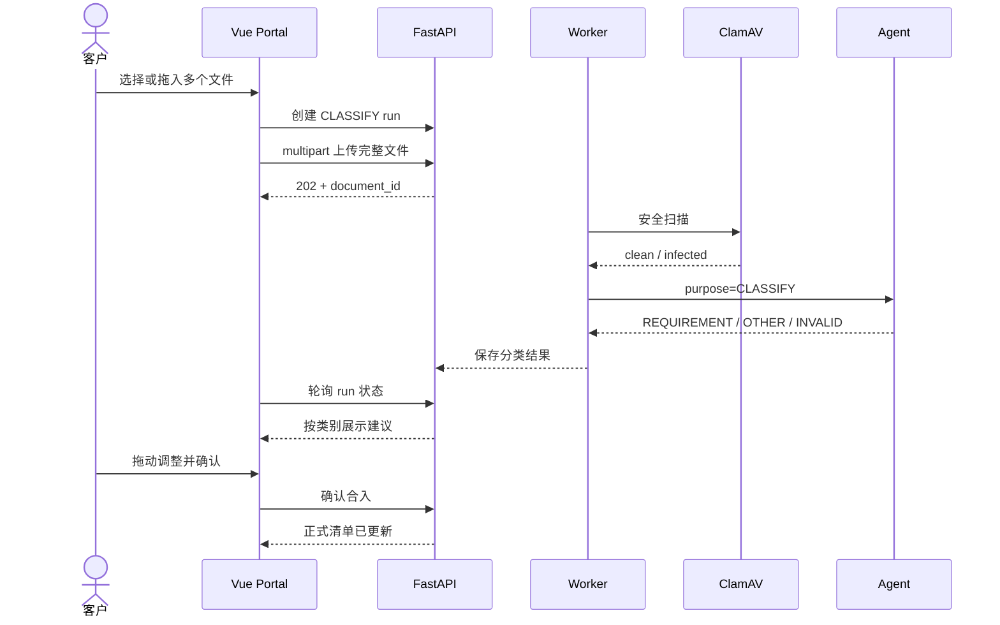
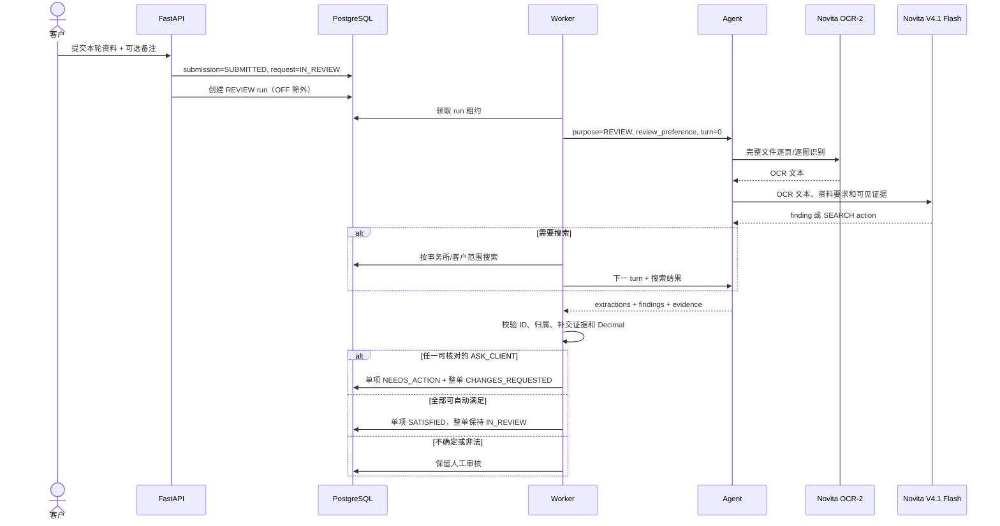
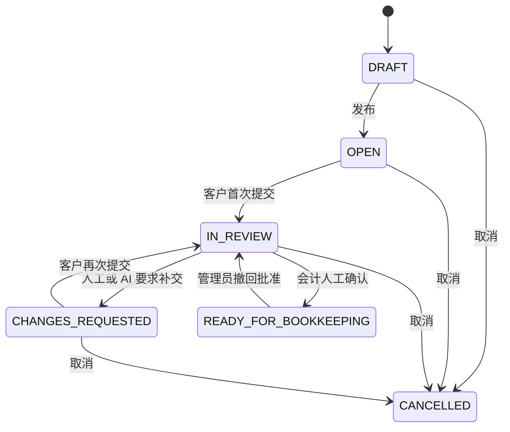
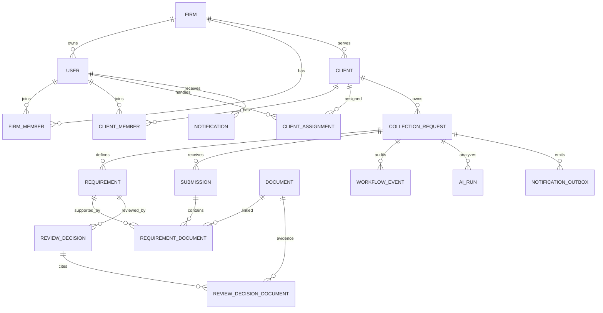

# Folio——系统设计说明书

| 文档属性 | 内容 |
| --- | --- |
| 系统名称 | Folio |
| 文档版本 | 1.1 |
| 文档状态 | 当前交付基线（随实现更新） |
| 基线日期 | 2026-09-26 |
| 适用对象 | 项目负责人、会计业务人员、研发、测试、运维及 AI 团队 |
| 设计范围 | Web 前端、业务后端、异步 Worker、AI Agent、数据存储、容器部署和运维边界 |

## 1. 文档目的

本文是系统最终交付和项目汇报的总说明，回答以下问题：

1. 系统解决什么业务问题，已经交付哪些能力；
2. 用户、前端、后端、Worker、Agent 和数据存储如何协作；
3. 核心业务状态、数据、权限和接口如何设计；
4. AI 能做什么、不能做什么，真实模型如何接入；
5. 当前演示环境怎样部署、验证和恢复；
6. 哪些能力已经实现，哪些仍属于正式生产前待办。

本文描述当前交付基线，不用未来规划冒充已实现功能。阶段开发过程和详细 Agent 协议分别参见文末交付物索引。

汇报用架构图（独立 HTML，内嵌矢量图与技术标识，可离线查看）：

- [系统架构与技术栈](./Folio_系统架构与技术栈.html)
- [前端架构](./Folio_前端架构.html)：浏览器 SPA、会计与客户工作区、共享状态、API 调用及静态部署。
- [后端架构](./Folio_后端架构.html)：API、权限与事务、Worker、证据搜索、基础设施及结果回写。
- [AI Agent 架构](./Folio_AI_Agent架构.html)：独立接口、文件校验、OCR、两阶段分析、结果校验及 Backend 边界。

## 2. 项目背景与目标

会计事务所在每月记账前，需要客户提交发票、收据、银行对账单和相关支持材料。传统流程主要依赖邮件、即时通信和人工表格，常见问题包括：

- 客户不知道还缺哪些材料；
- 文件期间、主体或内容错误，直到会计开始工作后才被发现；
- 客户经理需要反复催办并手工整理文件；
- 多轮补交缺少统一记录，审核责任和证据关系难以追溯；
- 资料准备时间不可见，延迟记账和财务关账。

本系统以“资料要求”为中心，把账户管理、请求创建、客户上传、多轮补交、审核、AI 辅助和审批记录放到同一条可审计流程中。

核心目标不是简单保存文件，而是持续推动每个资料项从“待提交”到“已满足”，最终由会计确认整单可以进入记账。

```text
事务所定义资料要求
        ↓
客户上传并确认分类
        ↓
客户提交一个资料轮次
        ↓
自动分析或会计人工审核
        ↓
通过 / 要求补交 / 人工升级
        ↓
多轮补交，直到全部必交项完成
        ↓
会计人工确认整单
```

## 3. 交付范围与当前状态

### 3.1 已实现能力

| 领域 | 当前能力 |
| --- | --- |
| 身份认证 | JWT 登录、access token 刷新、登出撤销、修改密码、邀请接受、密码重置 |
| 组织与账户 | 事务所员工、客户、客户联系人、角色、会计分配、客户银行账户 |
| 收集请求 | 创建、编辑草稿、复制历史请求、发布、取消、筛选、排序和分页 |
| 客户门户 | 查看请求、拖动上传、批量上传、文件预览、备注、移除草稿文件、提交、补交和公开流程时间线 |
| 文件处理 | PDF/PNG/JPEG 校验、大小限制、SHA-256 去重、隔离区、ClamAV 扫描、受控下载 |
| 审核闭环 | 单项通过、退回、豁免，多轮补交，整单人工确认与撤回确认；AI 自动退回后客户可原样提交并请求人工复审 |
| 证据与审计 | 显式 evidence 关系、不可变审核决定、活动记录、SYSTEM/USER actor 区分 |
| AI 基线 | Novita DeepSeek-OCR-2 逐页识别 PDF/图片，再由 DeepSeek-V4.1-Flash 快速分类或提交后完整审核；支持搜索、金额关系、自动退回和自动满足单项 |
| 站内通知 | 通知列表、未读数、已读操作；按公开工作流事件向相关用户生成通知 |
| 前端体验 | 响应式布局、英文默认、简体中文、浅色/深色主题、统一筛选和状态展示 |
| 工程交付 | 前后端与 Agent 独立仓库和镜像、GitHub Actions、ECR、Docker Compose 部署 |

### 3.2 部分实现或待外部条件

| 能力 | 当前状态 |
| --- | --- |
| AI 质量验证 | 真实 OCR 和 Flash 已联调并上线；部分 v5 case 已抽样验证，但未完成全量数据集、误退回率及财务专业评估。自训练模型的 `REMOTE` 适配接口仍待模型团队交付 |
| Email/飞书通知 | 站内通知已实现；外部渠道 Outbox 和去重已实现，但记录为 `SUPPRESSED/PROVIDER_DISABLED`，不实际发送 |
| HTTPS 与正式域名 | `https://folio.sarl` 已接入 Cloudflare 和源站 TLS，生产启用安全 Cookie；仍需持续监测证书续期和安全配置 |
| 自动备份与恢复演练 | 已定义要求，尚未交付定时备份、异地副本和可验证恢复报告 |
| 监控告警 | 有健康检查和结构化日志基线；尚未接入集中日志、指标平台和告警渠道 |

### 3.3 明确不在本次范围

- 自定义流程设计器、拖拽审批节点和复杂模板市场；
- PostgreSQL RLS、独立消息中间件、Celery 和微服务拆分；
- S3/对象存储、CDN、多节点容灾和自动扩缩容；
- 向量数据库和模型训练平台；
- FastAPI 管理后台、SQLAdmin 和面向运维人员的低代码后台；
- 正式 Email、飞书、短信通知 Provider。

## 4. 需求追踪

| 业务问题 | 系统设计 | 验收表现 |
| --- | --- | --- |
| 客户不知道缺什么 | 收集请求包含结构化 requirements | 客户门户逐项显示必交材料和当前状态 |
| 文件经常不完整或错误 | 安全扫描、快速分类、提交后主体/期间/金额审核 | 问题项显示明确原因并可退回补交 |
| 反复提醒耗时 | Dashboard、截止日期、状态筛选、站内通知与外部渠道 Outbox | 会计可快速定位等待客户、逾期和待审核请求 |
| 补交后历史混乱 | 每次提交生成独立 submission round | 会计统一切换轮次，旧文件和决定仍可追溯 |
| 多文件关系复杂 | requirement 与 document 多对多，保存 evidence relation | 支持多发票对一笔付款、历史发票和当前付款等场景 |
| AI 结论不可控 | Backend 校验 Agent 输出，整单批准始终人工 | 非法 evidence、证据不足或错误金额关系转人工 |
| 多客户数据泄漏风险 | firm/client 作用域授权和复合外键 | 猜测其他客户资源 ID 无法读取或关联 |
| 操作重复或并发冲突 | Idempotency-Key、版本号和行锁 | 重复请求不产生重复事件，旧版本写入返回冲突 |

## 5. 用户与权限设计

### 5.1 固定角色

| 角色 | 主要职责 |
| --- | --- |
| `FIRM_ADMIN` | 管理事务所员工、客户、分配关系和全部请求；可撤回整单批准 |
| `ACCOUNTANT` | 管理被分配客户的收集请求、审核、退回、豁免和整单确认 |
| `CLIENT_ADMIN` | 查看所属客户请求、上传和提交资料，并管理本客户联系人 |
| `CLIENT_SUBMITTER` | 查看所属客户请求、上传、移除草稿资料和提交 |

### 5.2 权限矩阵

| 操作 | 事务所管理员 | 会计 | 客户管理员 | 客户提交人 |
| --- | :---: | :---: | :---: | :---: |
| 管理事务所员工 | ✓ | — | — | — |
| 创建和维护客户 | ✓ | 查看已分配 | 查看所属客户 | 查看所属客户 |
| 分配会计 | ✓ | — | — | — |
| 管理客户联系人 | ✓ | 已分配客户 | 所属客户 | — |
| 创建、复制和发布请求 | ✓ | 已分配客户 | — | — |
| 上传、移除草稿和提交资料 | — | — | ✓ | ✓ |
| 查看客户公开反馈 | ✓ | ✓ | ✓ | ✓ |
| 单项审核和豁免 | ✓ | 已分配客户 | — | — |
| 整单批准 | ✓ | 已分配客户 | — | — |
| 撤回整单批准 | ✓ | — | — | — |

前端路由守卫仅用于改善体验。后端每次请求都根据 JWT 中的用户、事务所成员关系、客户成员关系或会计分配关系重新授权。

## 6. 设计原则与关键取舍

| 决策 | 采用方案 | 设计理由 |
| --- | --- | --- |
| 应用形态 | 模块化单体 Backend + 独立 Agent | 业务事务集中、部署简单，同时隔离模型与文件信任边界 |
| 事实源 | PostgreSQL | 状态迁移、审核决定、事件和 Outbox 可在同一事务提交 |
| Redis 用途 | 会话撤销和限流等可重建状态 | 不把审批状态放入易失缓存 |
| 异步任务 | 数据库租约 Worker | 当前单机规模无需额外消息中间件 |
| 工作流 | 固定状态机和业务动作 API | 流程明确，不为暂不存在的自定义流程需求引入引擎 |
| 文件存储 | Docker 持久卷 | 满足当前单机演示；容量和容灾成为瓶颈后再迁移 S3 |
| AI 接入 | 独立只读 Agent + 远端模型 API | 模型无权访问业务数据库，Backend 保持最终裁决权 |
| 通知 | 站内 `notifications` + 外部渠道 Transactional Outbox | 站内通知供用户立即查看；Email/飞书未启用时不阻塞业务 |
| 前后端命名 | API `snake_case`，前端 `camelCase` | 后端符合 Python 习惯，转换集中在 Axios 边界 |
| 前端状态 | Pinia 仅保存认证和 UI 偏好 | 页面数据以服务端为准，避免第二套业务状态 |

## 7. 系统上下文



系统只负责“资料是否满足本次记账准备要求”，不执行总账记账、税务申报、付款或银行操作。

## 8. 总体技术架构



核心边界：

- 浏览器只能访问 Nginx；
- Backend 是唯一业务入口和状态机所有者；
- Worker 与 API 使用同一个后端镜像，但启动命令不同；
- Agent 没有 PostgreSQL、Redis、JWT 密钥和业务写权限；
- Nginx 只读挂载最终资料卷，不挂载隔离区；
- Agent 的内网 `/v1/analyze` 使用只读 documents 卷；可复用的 `/v1/analyze-inline` 接受 Base64 文件，但只有配置独立 Agent API Key 后才启用，当前 Compose 不把 Agent 端口暴露到宿主机；
- 模型故障不影响人工上传、审核和批准。

## 9. 组件设计

### 9.1 Vue 前端

职责：

- 事务所工作台、客户门户和账户页面；
- 表单校验、筛选、分页、排序和响应式交互；
- access JWT 内存管理及 refresh 协调；
- 上传进度、文件拖放、AI 分类确认和审核结果展示；
- 英文/简体中文、浅色/深色主题和移动端适配。

前端不决定权限和状态迁移，也不持久化服务端业务事实。

### 9.2 Nginx

职责：

- 统一 Web 入口；
- `/api/` 反向代理至 Backend；
- 其他路径转发至 Frontend；
- 通过 internal location 提供已经授权的文件；
- 统一上传大小、代理超时和安全响应头。

### 9.3 FastAPI Backend

职责：

- 认证、租户授权和角色权限；
- 账户、客户、请求、资料项和提交轮次管理；
- 业务状态机、幂等、并发控制和审计；
- 文件元数据、受控下载和 Portal 数据隔离；
- AI run 编排、输出校验、自动单项决定和人工覆盖；
- 站内通知及外部渠道 Outbox 生成。

### 9.4 Backend Worker

职责：

- 隔离文件的异步安全扫描与落盘；
- 领取 CLASSIFY/REVIEW run；
- 调用 Agent、处理超时、重试和租约过期；
- 执行授权范围内的当前/历史资料搜索；
- 保存结构化 AI 输出并在事务内应用允许的自动决定。

任务使用数据库状态、`next_attempt_at`、`locked_by` 和 `locked_until` 实现租约；外部 HTTP 调用不占用长事务。

### 9.5 acc-system-agent

职责：

- 校验 `storage_key`、普通文件、MIME 文件头、大小和 SHA-256；
- 从只读卷读取完整 PDF/图片；
- PDF 逐页渲染、图片预处理后调用 Novita DeepSeek-OCR-2，再把 OCR 文本及允许的上下文送入 DeepSeek-V4.1-Flash；
- 使用配置值记录实际模型版本，不信任模型自行生成的版本字符串；
- 校验 CLASSIFY/REVIEW 的严格 schema；
- 提供可独立复用的鉴权 `/v1/analyze-inline`，与内网卷协议共享分析逻辑；
- 返回稳定错误，不泄漏模型响应、文件内容或密钥。

Agent 可以提出 `SEARCH_CURRENT/SEARCH_HISTORY` 请求，但搜索由 Backend 在租户与客户范围内执行；Agent 不能直接搜索数据库、修改状态、发送通知或批准整单。

### 9.6 PostgreSQL

保存账户、客户、收集请求、提交轮次、文件元数据、审核决定、事件、AI run、站内通知、幂等记录和 Outbox。它是业务事实的唯一权威来源。

### 9.7 Redis

保存 refresh session/revocation 和限流等可重建状态。Redis 不保存收集请求和审核结论。

### 9.8 文件卷与 ClamAV

- 新文件先写入 quarantine；
- Worker 调用 ClamAV；
- 扫描通过后移动到 documents；
- 扫描完成前不能预览、下载或交给 Agent；
- 文件记录保存 SHA-256，重复内容可复用底层文件；
- 业务“删除”通过 link 排除实现，不直接删除审计历史。

## 10. 核心业务流程

### 10.1 账户与客户建立

1. 事务所管理员创建客户并分配会计；
2. 事务所人员邀请第一个客户管理员；
3. 客户管理员接受邀请并可继续邀请客户提交人；
4. 邀请 token 只保存哈希、具有有效期且只能使用一次；
5. 最后一个有效客户管理员不能被移除或降级。

### 10.2 创建和发布收集请求

1. 会计选择客户、期间、截止日期和资料要求；
2. 系统根据资料类型设置内部 `analysis_type`，用户不手工选择；
3. 会计选择 AI 模式和自动处理偏好；
4. 草稿可继续编辑或复制历史请求；
5. 发布后请求进入 `OPEN`，资料要求不再物理删除；
6. 同一客户和期间只允许一个未取消请求。

### 10.3 上传与快速分类



分类确认前，文件不进入正式资料清单。分类阶段只返回类别、资料类型、目标资料项和置信度，不执行主体、期间、金额或审核判断。

### 10.4 客户提交与 AI 审核



报销单的合计只是待验证主张。对于含报销单的审核，自动满足前还须证明每笔报销行都有不同的原始收据，收据金额、币种和报销合计一致，并在审核证据及结构化金额关系中引用这些收据。Agent 与 Backend 双重校验；缺失收据经当前资料搜索仍未找到时可明确退回补交，校验失败或无法定位缺口时留给会计复核。

补交动作按“客户需要上传什么”归属，而不是按“哪个分析发现问题”归属。银行对账发现支持发票不足时，银行资料项保持待审核，发票资料项进入 `NEEDS_ACTION`。`MISSING/INCOMPLETE` finding 通过 `requested_document_type` 声明补交类型；Agent 和 Backend 会拒绝错误归属，目标类型不在清单中时也不自动退回，而是交由会计处理。

若客户认为 AI 自动退回有误，可在下一轮选择“请求人工复审”，保留原有有效文件并原样提交；该轮不创建 REVIEW run，直接进入会计待办。普通补交仍按请求的 AI 模式执行。

### 10.5 会计审核与整单确认

1. 会计按 submission round 切换本轮文件；
2. 页面展示文件预览、客户整体备注、提取字段、AI finding 和 evidence；
3. 会计可以一键把 AI 建议填入审核表单，再手工修改；
4. 保存人工决定时必须显式选择 evidence；
5. 任一资料项未完成审核时，不能要求补交或批准下一步；
6. `WAIVE` 必须由会计填写理由；
7. 全部必交项为 `SATISFIED/WAIVED` 后，会计才可确认整单；
8. AI 永远不能执行整单批准。

## 11. 状态机设计

### 11.1 收集请求状态



对外显示：

| 内部状态 | 主要显示文本 |
| --- | --- |
| `DRAFT` | 草稿 |
| `OPEN` | 待客户提交 |
| `IN_REVIEW` 且 AI 未全部完成 | 审核中 |
| `IN_REVIEW` 且本轮 AI 全部通过 | 待人工确认 |
| `CHANGES_REQUESTED` | 待客户补交 |
| `READY_FOR_BOOKKEEPING` | 已确认 |
| `CANCELLED` | 已取消 |

`READY_FOR_BOOKKEEPING` 是当前流程的“已确认”终点；数据库旧约束中的 `CLOSED` 仅为历史兼容，不提供关闭操作或用户筛选项。`IN_REVIEW` 的“待人工确认／待人工审核”是基于 AI run 和单项结果推导的展示状态，不新增持久状态；客户端筛选只保留统一的“审核中”。

### 11.2 资料项状态

| 状态 | 含义 |
| --- | --- |
| `PENDING` | 尚未收到可审核资料 |
| `RECEIVED` | 已收到，等待审核 |
| `NEEDS_ACTION` | 有问题，等待客户补交或说明 |
| `SATISFIED` | 已满足 |
| `WAIVED` | 会计明确豁免 |

问题原因使用独立 `issue_code`：`MISSING`、`WRONG_PERIOD`、`ENTITY_MISMATCH`、`UNREADABLE`、`INCOMPLETE`、`OTHER`。

### 11.3 文件状态

```text
QUARANTINED → AVAILABLE
QUARANTINED → FAILED
QUARANTINED → EXCLUDED
AVAILABLE   → EXCLUDED（通过关联记录逻辑排除）
```

### 11.4 AI run 状态

```text
DRAFT → QUEUED → PROCESSING → SUCCEEDED
                     ├──────→ FAILED
                     └──────→ CANCELLED
```

分类 run 使用 `confirmed_at` 和 confirmation 独立记录用户是否合入，避免把“模型成功”和“用户接受结果”混为同一状态。

## 12. 数据架构

### 12.1 核心实体关系



### 12.2 表分组

| 分组 | 表 |
| --- | --- |
| 身份与权限 | `firms`, `users`, `firm_members`, `client_members`, `client_assignments` |
| 客户基础资料 | `clients`, `client_bank_accounts`, `user_invites`, `password_reset_tokens` |
| 收集流程 | `collection_requests`, `requirements`, `submissions`（含 `manual_review_requested`） |
| 文件与证据 | `documents`, `requirement_documents`, `review_decision_documents` |
| 审核与审计 | `review_decisions`, `workflow_events`, `audit_events` |
| 异步与可靠性 | `ai_runs`, `notification_outbox`, `idempotency_records` |
| 站内通知 | `notifications`，按接收人记录标题、内容、已读时间及目标请求 |

### 12.3 关键约束

- 所有业务实体直接或间接受 `firm_id` 约束；
- 子表通过复合外键阻止跨事务所关系，而非只依赖代码过滤；
- 同一客户、期间最多一个未取消请求；
- 同一请求、轮次号唯一，且同一时间最多一个 DRAFT submission；
- `review_decisions` 和工作流事件只追加，不覆盖历史；
- 同一 `ai_run + requirement` 最多一条 AI 自动决定；
- Outbox `dedupe_key` 唯一；
- 月度期间存当月第一天，时间戳统一存 UTC；
- 金额关系通过十进制字符串传输，由 Backend 使用 `Decimal` 重算。

### 12.4 多轮提交模型

补交不会覆盖旧文件。每次客户提交形成一个新的 `submission.round_no`，新一轮默认继承仍有效的历史资料关联；客户可以在可编辑状态下排除旧文件并追加新文件。会计审核页一次只查看一个轮次，避免把所有轮次堆叠成无法理解的文件列表。

若上一轮由 AI 自动退回，客户可在补交时对结果提出异议并请求人工复审。客户可以原样提交上一轮仍有效的资料，系统将文件关联到新的 submission，而不要求重复上传。该轮跳过 AI REVIEW run，直接进入会计待办；系统不会把普通补交或人工退回伪装成 AI 异议。会计保留最终决定权，原 AI 决定和新人工决定均进入审计历史。

客户门户从 `workflow_events` 派生精简时间线，仅公开发布、提交、AI 审核完成、退回补交、会计确认、撤回确认和取消节点。Backend 在响应前过滤事件类型并清理 payload；逐项审核、内部备注、证据搜索轨迹、模型原始输出和操作人信息不下发给客户。

## 13. API 与接口设计

### 13.1 通用约定

- 业务 API 前缀：`/api/v1`；
- 请求和响应字段：`snake_case`；
- 前端通过 Axios 边界转换为 `camelCase`；
- 错误结构：`{ code, message, details, request_id }`；
- 列表使用服务端分页、排序和过滤；
- 状态迁移使用动作端点，不开放任意状态字段修改；
- 关键写操作携带 `Idempotency-Key`；
- 可并发编辑实体携带 `version`，旧版本返回 `409`。

### 13.2 API 分组

| 分组 | 代表端点 |
| --- | --- |
| 认证 | `POST /auth/login`, `/auth/refresh`, `/auth/logout`, `GET /me` |
| 邀请和密码 | `/auth/invitations/accept`, `/auth/password-reset/*`, `/me/password` |
| 员工与客户 | `/users`, `/clients`, `/clients/{id}/members`, `/assignments`, `/bank-accounts` |
| 收集请求 | `/collection-requests`, `/{id}/publish`, `/{id}/copy`, `/{id}/cancel`, `/{id}/events` |
| 客户门户 | `/portal/collection-requests`, `/documents`, `/document-links`, `/{id}/submit` |
| 上传分类 | `/portal/collection-requests/{id}/classification-runs/*` |
| 审核 | `/requirements/{id}/review`, `/{id}/request-changes`, `/{id}/approve`, `/{id}/reopen` |
| AI 审核查询 | `/collection-requests/{id}/review-runs`, `/{run_id}/retry` |
| 站内通知 | `GET /notifications`, `POST /notifications/{id}/read`, `POST /notifications/read-all` |
| 文件下载 | 员工 `/documents/{id}/download`；客户 `/portal/document-links/{id}/download` |
| 健康检查 | `/health/live`, `/health/ready` |

### 13.3 Backend-Agent 接口

```http
POST /v1/analyze
Content-Type: application/json
Idempotency-Key: <run_id>:<turn>
```

`purpose` 为 `CLASSIFY | REVIEW`。Backend 发送 `document_id`、`storage_key`、`content_type` 和 `sha256`；Agent 在只读卷校验路径及哈希后读取文件。当前 Novita 路径先将每一页 PDF/图片送 OCR-2，再将识别文本送 Flash；Flash 不直接读取文件二进制或文件名。独立复用入口 `POST /v1/analyze-inline` 接收带 Base64 的同义任务，需要单独的 Agent API Key；将来由模型团队交付的 `REMOTE` 适配仍可使用完整文件传输，不能与现有 Novita 链路混为一谈。Agent 对外复用需另配认证和 HTTPS 网关，当前生产不公开其容器端口。

严格字段、枚举和示例见 [AI Agent 接口与架构交接](./README_AI_Agent接口与架构交接.md)。

### 13.4 通知 Provider 接口

首版只定义最小边界：

```python
send(recipient: str, template: str, payload: dict) -> None
```

业务事务只写 Outbox。渠道 Worker 以后消费 Outbox，不允许由页面请求直接调用 Email/飞书并决定业务提交是否成功。

## 14. 前端设计

### 14.1 技术栈

- Vue 3 + TypeScript + Vite；
- Vue Router + Pinia；
- shadcn-vue / reka-ui + Tailwind CSS；
- Axios + axios-case-converter；
- Vue I18n；
- Vitest + ESLint + vue-tsc。

### 14.2 页面结构

```text
/login
/invitations/accept

/staff
  /profile
  /notifications
  /collections
  /collections/new
  /collections/:id
  /collections/:id/edit
  /collections/:id/review
  /clients
  /clients/:id
  /admin/users

/client
  /profile
  /notifications
  /collections
  /collections/:id
  /contacts
```

### 14.3 状态归属

| 状态 | 归属 |
| --- | --- |
| access JWT、当前用户 | Pinia auth，内存 |
| 主题、侧栏、语言偏好 | Pinia/UI 与本地非敏感偏好 |
| 列表筛选、分页、排序 | URL query |
| 请求详情和审核数据 | 页面查询，服务端为准 |
| 权限和状态迁移 | Backend |

### 14.4 交互原则

- 使用业务动作名称，不让用户直接编辑状态；
- 会计审核采用资料项、预览、决定三栏布局；
- 活动记录统一放在请求详情，不在审核页重复一套；
- 客户只看到经过后端过滤的公开进度，明确区分 AI 审核、转人工及最终人工确认；
- 文件列表按轮次切换，客户备注按整轮展示；
- 客户与会计的底部主操作栏固定于视口，使用不透明底色并为正文预留滚动空间；
- 破坏性操作、豁免和最终批准使用 Dialog 确认；
- 搜索即时生效，不要求额外 Apply；
- 小屏布局减少表格列并改为信息卡，不强行压缩桌面表格；
- 状态同时使用文字和图标，不能只靠颜色。

### 14.5 视觉和国际化

界面采用 iOS 风格的信息层级、留白、圆角和适度半透明效果，但不牺牲表格密度和会计业务可读性。所有卡片、筛选器和状态控件使用统一设计 token。

英文是默认 locale 和 fallback；简体中文可由用户主动选择。API 枚举和错误 code 保持稳定英文值，前端映射为本地化文本。日期、数字和币种通过 `Intl`/Vue I18n 格式化。

## 15. 后端设计

### 15.1 技术栈

- Python 3.12；
- uv；
- FastAPI + Pydantic；
- SQLAlchemy 2 + Alembic；
- PostgreSQL；
- Redis；
- PyJWT；
- Argon2 密码哈希；
- pytest。

### 15.2 模块边界

```text
app/api/auth.py            认证和会话
app/api/accounts.py        员工、客户、联系人、邀请和分配
app/api/collections.py     请求、资料项、列表和事件
app/api/portal.py          客户上传、文件和提交
app/api/classification.py  CLASSIFY run
app/api/review.py          审核、审批和 REVIEW run 查询
app/api/notifications.py   站内通知列表与已读操作
app/worker.py              文件安全处理和任务轮询
app/review_analysis.py     REVIEW 编排、搜索和自动决定
app/models.py              业务数据模型与数据库约束
```

### 15.3 事务与一致性

状态迁移统一执行：

1. 按租户加载并锁定请求；
2. 校验角色、分配关系、当前状态和 `version`；
3. 更新当前快照；
4. 追加审核决定或事件；
5. 必要时写 Outbox；
6. 同一事务提交。

幂等记录保存 actor、key、路径、请求哈希和响应。相同 key、相同请求返回原结果；相同 key、不同请求返回冲突。

### 15.4 Worker 可靠性

- `FOR UPDATE SKIP LOCKED` 领取任务；
- 租约过期可被其他 Worker 重领；
- 外部调用在事务外执行；
- 结果回写前重新检查 lease、请求状态和 submission；
- 迟到结果不能覆盖新轮次；
- Agent 不可用最多有限重试，最终转人工而非破坏业务状态。

## 16. AI 设计

### 16.1 两阶段策略

| 阶段 | 触发时机 | 允许输出 | 禁止事项 |
| --- | --- | --- | --- |
| CLASSIFY | 文件上传并安全扫描后 | 类别、资料类型、目标资料项、置信度 | 主体/期间/金额审核、搜索和状态修改 |
| REVIEW | 客户正式提交后 | 提取字段、finding、evidence、金额关系、搜索动作 | 直接访问数据库、豁免、整单批准和通知发送 |

### 16.2 AI 模式

| 模式 | 行为 |
| --- | --- |
| `OFF` | 不创建提交后 REVIEW run |
| `SUGGEST` | 保存并展示分析，始终由会计决定 |
| `AUTO_REVIEW` | Agent 按请求审核偏好建议动作，Backend 校验后可自动满足或退回单项；整轮全通过后仍等待会计确认 |

新请求默认 `AUTO_REVIEW + STANDARD`。`review_preference` 可选 `CAUTIOUS | STANDARD | EFFICIENT`，指导模型在“明确补交”与“转会计审核”之间分流，不改变事实判断、证据要求或人工整单批准。旧阈值字段只作历史兼容，不再控制自动决定。

### 16.3 自动执行边界

只有同时满足以下条件，Backend 才自动应用 finding：

- 请求为 `AUTO_REVIEW`；
- 建议是 `SATISFY` 或 `REQUEST_ACTION`；
- `ASK_CLIENT` 指向明确问题；主体/期间不符有矛盾证据，缺失/不完整事项先搜索，模糊或不可读事项转人工；
- evidence 属于同事务所、同客户和有效提交；
- 所有 ID、枚举和 schema 合法；
- 金额关系通过 Backend `Decimal` 重算；
- 当前资料项仍处于可应用状态；
- finding 不是 `ESCALATE`。

REVIEW finding 不包含模型自报的 `confidence`；旧审核记录的该字段在对外读取时过滤。偏好属于 Agent 的行为指引，Backend 仍拥有最终状态迁移权；该机制在真实材料上的误退回率尚需单独验证。

任一自动 `REQUEST_ACTION` 会把整单退回客户。全部单项自动通过时，整单保持 `IN_REVIEW` 并显示“待人工确认”。

### 16.4 可解释性与人工覆盖

会计侧展示：

- 模型提取字段；
- 主体和期间检查；
- 当前和历史 evidence 及关系；
- 金额 operands、运算和差额；
- 转人工原因；
- AI 自动决定标识。

人工决定会追加新记录并成为当前结论，AI 和旧人工记录继续保留。客户侧只显示公开状态和 `client_message`，不返回模型原始输出、REVIEW 置信度、内部备注和搜索轨迹。AI 自动退回后，客户可请求人工复审并原样再提交，本轮跳过 AI；此选择和复审结果同样留痕。

### 16.5 当前上线状态

生产环境已经部署独立 Agent，分类与审核均走 Novita 提供的 OCR-2 和 V4.1 Flash：

```text
AGENT_CLASSIFICATION_PROVIDER=DEEPSEEK
AGENT_REVIEW_PROVIDER=DEEPSEEK
OCR_MODEL=deepseek/deepseek-ocr-2
MODEL_NAME=deepseek/deepseek-v4.1-flash
MODEL_REQUEST_TIMEOUT_SECONDS=300
```

Novita 密钥仅保存在服务器环境文件，不写入文档、镜像或日志。REVIEW 请求启用低强度 reasoning；`CLASSIFY` 不启用。Agent 为 PDF 逐页/图片逐张 OCR，模型分析仅见 OCR 文本及受控业务上下文。Agent 记录各阶段结构化日志，保证不泄漏文件正文或密钥。已经用部分真实调用验证链路，但不能把抽样案例等同于全量准确率或财务质量验收。

## 17. 安全与隐私设计

### 17.1 认证与会话

- 密码使用 Argon2 哈希；
- access JWT 只保存在前端内存，通过 Bearer header 发送；
- refresh JWT 使用 HttpOnly Cookie；
- refresh token 轮换并检测重放；
- 修改密码和登出会撤销相应会话；
- 登录、邀请和密码重置接口限流；
- 生产 HTTPS 已启用 `Secure` Cookie。

### 17.2 租户与授权

- 后端不接受请求参数提供 `firm_id`；
- 从已验证 Principal 取得事务所；
- 员工按事务所角色和客户分配授权；
- 客户按 `client_members` 授权；
- 不可见资源优先返回 404，减少 ID 枚举；
- 数据库复合外键阻止跨事务所关联。

### 17.3 文件安全

- 只允许 PDF、PNG、JPEG；
- 同时检查扩展名、声明 MIME 和文件头；
- 单文件默认最大 25 MiB；
- 新文件先进入不可下载隔离区；
- 生产环境必须经 ClamAV 扫描；
- 文件名只作为展示值，storage key 由服务端生成；
- 下载先授权，再通过 Nginx internal location 返回；
- `Content-Disposition` 和 `nosniff` 防止浏览器执行不可信内容；
- Agent 使用目录描述符和 `O_NOFOLLOW` 防止路径穿越和符号链接攻击。

### 17.4 密钥与日志

- 数据库密码、JWT secret、AWS 凭据和模型密钥不进入 Git 或镜像；
- GitHub Actions 通过 OIDC 获取 AWS 临时凭证；
- 应用日志不得记录密码、JWT、Cookie、文件正文、Base64 或模型原始敏感响应；
- 错误响应使用稳定 code，不回显供应商内部错误。

### 17.5 当前安全缺口

域名、TLS 和 `COOKIE_SECURE=true` 已部署。剩余风险主要是备份加密与恢复演练、SSH 来源维护、集中日志、漏洞扫描、模型输出质量监测和权限复核；现有 HTTPS 不能替代这些生产保障。

## 18. 部署与发布设计

### 18.1 仓库

| 仓库 | 职责 |
| --- | --- |
| `acc-system-frontend` | Vue SPA、组件、路由、i18n 和前端测试 |
| `acc-system-backend` | API、Worker、迁移、Compose 和 Nginx 配置 |
| `acc-system-agent` | 只读 AI 适配层和严格协议校验 |
| `acc-system-docs` | 业务、架构、开发、Agent 接口和交付文档 |

### 18.2 镜像和服务

| 服务 | 镜像 |
| --- | --- |
| frontend | ECR `acc-system-frontend:<git-sha>` |
| backend / worker / migrate | ECR `acc-system-backend:<git-sha>` |
| nginx | ECR `acc-system-nginx:<git-sha>` |
| agent | ECR `acc-system-agent:<git-sha>` |
| postgres | 官方 `postgres:17.6-alpine` |
| redis | 官方 `redis:8.2.1-alpine` |
| clamav | 官方 `clamav/clamav:1.4` |

数据库和 Redis 已经是独立镜像，不为“自建镜像”复制一份内容相同的 Dockerfile。

### 18.3 CI/CD

```mermaid
flowchart LR
    Push[Push / Pull Request] --> Test[测试、Lint、构建]
    Test -->|main / tag| OIDC[GitHub OIDC]
    OIDC --> ECR[推送不可变 SHA 镜像]
    ECR --> Manual[受控服务器部署]
    Manual --> Pull[docker compose pull]
    Pull --> Migrate[一次性 migrate]
    Migrate --> Up[docker compose up -d]
    Up --> Health[健康检查与页面验收]
```



GitHub Actions 负责测试、构建和推送 ECR，不直接 SSH 生产服务器。服务器 `.env.prod` 固定 SHA 标签，避免 `latest` 造成不可复现发布。

### 18.4 当前演示部署

| 项目 | 当前值 |
| --- | --- |
| 主机 | AWS Lightsail Ubuntu，Singapore `ap-southeast-1` |
| 入口 | `https://folio.sarl`（Cloudflare 代理，源站 TLS） |
| 对外端口 | 80/443；SSH 22 按来源白名单管理 |
| Compose 服务 | nginx、frontend、backend、worker、agent、postgres、redis、clamav |
| 数据库 revision | `0016_manual_review_request` |
| Frontend image | `b9ec9d2e2ce3227ffb8b351a888e4605a35c3151` |
| Backend image | `f9b3114a66c38a7dd5ac5ec95430ff039c1c43bb` |
| Agent runtime image | `fac75993ee6a397f553c1c96c45c5351a59cdcab` |
| Backend readiness | PostgreSQL、Redis 均为 `ok` |
| Agent readiness | 生产配置 `DEEPSEEK` 分类与审核，Novita OCR/Flash 已联通；业务 API 的 ready 不依赖 Agent |

### 18.5 发布与回滚

标准发布：

```bash
docker compose --env-file .env.prod -f compose.yml -f compose.tls.yml pull
docker compose --env-file .env.prod -f compose.yml -f compose.tls.yml run --rm migrate
docker compose --env-file .env.prod -f compose.yml -f compose.tls.yml up -d
```

应用回滚通过恢复 `.env.prod` 中上一组不可变镜像 SHA 并重新启动完成。数据库迁移回滚不能仅依赖应用镜像；破坏性迁移前必须备份，并优先使用向后兼容的扩展迁移。

## 19. 可用性、运维与恢复

### 19.1 健康检查

| 服务 | 检查 |
| --- | --- |
| Backend live | 进程是否运行 |
| Backend ready | PostgreSQL 和 Redis 是否可用 |
| Agent live | Agent 进程和版本 |
| Agent ready | 资料卷和远端模型是否可用 |
| PostgreSQL | `pg_isready` |
| Redis | 认证后的 `PING` |
| Nginx | 首页可访问 |

Backend readiness 不依赖 Agent，从而保证模型故障时人工业务仍在线。

### 19.2 日志与审计

- 应用日志使用 `request_id` 串联请求；
- 业务审计记录 actor、事务所、资源和事件；
- 工作流活动记录向用户展示关键状态变化；
- AI run 保存模型版本、状态、错误类型和规范化输出；
- 日志与数据库审计职责分离，日志不是业务事实源。

### 19.3 正式生产建议

证书和续期任务已部署，但还需验证续期告警。以下是进一步生产化所需的运维项：

- PostgreSQL 每日备份和定期恢复演练；
- documents 卷加密快照和异地备份；
- 磁盘容量、API 错误、Worker 积压、AI 连续失败和备份失败告警；
- 定期验证证书续期及 Cloudflare 到源站的严格 TLS；
- 明确并批准 RPO/RTO。建议初始目标为 RPO 24 小时、RTO 4 小时，但这不是当前已验证承诺；
- 制定财务资料保留期限和客户删除请求处理规则。

## 20. 性能与扩展性

### 20.1 当前硬限制

| 项目 | 限制 |
| --- | --- |
| 单文件 | 默认 25 MiB |
| 分类/审核单批文件数 | 最多 100 |
| 单次 Agent 文件总量 | 最多 100 MiB |
| Agent 响应 | 最多 1 MiB |
| REVIEW 搜索 | 最多 3 轮 |
| 单轮搜索追加 | 最多 20 个文件，并受 100 文件总量限制 |
| 模型连接超时 | 默认 10 秒 |
| 模型请求超时 | Agent 当前配置 300 秒；REVIEW 总预算约 290 秒，CLASSIFY 约 150 秒 |
| OCR 页数与图像 | PDF 最多 20 页；单张图片最多 16 MP |
| OCR 文本 | 单次分析最多 120,000 字符 |

### 20.2 扩展路径

当前单节点 Compose 适合演示、小型事务所和早期验证，但尚未做负载测试，不能给出已验证并发容量。

达到以下信号时再演进：

| 信号 | 演进方案 |
| --- | --- |
| 文件卷容量或备份成为瓶颈 | 迁移 S3，对 Agent 使用受控对象读取 |
| Worker 队列持续积压 | 增加 Worker 副本，再评估消息队列 |
| 单机故障不可接受 | 托管 PostgreSQL/Redis、对象存储和多实例应用 |
| 历史搜索规模显著增加 | 增加专用检索索引；有证据后再评估向量搜索 |
| 多服务直接访问数据库 | 引入更严格服务边界和 PostgreSQL RLS |
| 通知量增加 | 独立 Outbox 消费者和渠道级幂等 |

## 21. 测试与验收

### 21.1 自动检查基线

| 子系统 | 结果 | 覆盖重点 |
| --- | --- | --- |
| Frontend | CI 执行 ESLint、类型检查、单测和 production build | 路由、认证、字段转换、账户、Portal、审核、通知和 AI 展示 |
| Backend | CI 执行单测和迁移相关检查 | JWT、租户隔离、文件、人工复审、提交、搜索、自动决定和通知 |
| Agent | 单测覆盖协议、文件边界、OCR、模型响应和幂等 | 分类、审核 schema、远端错误、金额和搜索动作 |

Backend 集成测试有主动安全保护：只允许 `ENVIRONMENT=test`、数据库名 `acc_test` 和 Redis DB 15，防止误删开发或生产数据。

### 21.2 关键验收场景

1. 管理员、会计、客户管理员和提交人的权限符合矩阵；
2. 猜测其他事务所或客户 ID 不能读取数据；
3. 会计创建、复制、发布和取消请求；取消后可为相同期间重建；
4. 客户拖动上传多个文件，确认分类前正式清单不变；
5. 扫描失败、分类失败或模型不可用时可转手动流程；
6. 客户提交带整体备注的第一轮资料；
7. G02 错期间和 G03 错主体产生明确补交原因；
8. B01 多发票合计和 B03 历史资料搜索保留完整 evidence；
9. F04 外币/手续费和 F05 进度款/保留款由 Backend 重算金额；
10. AI 自动退回问题轮次，全部通过时只进入“待人工确认”；
11. 会计可覆盖 AI 单项决定，但不能在必交项未完成时批准；
12. 客户补交只追加新轮次，旧文件和决定不消失；
13. 重复提交、Worker 重试和迟到结果不产生重复决定；
14. 客户 API 不返回内部备注、storage key、AI 原始输出和搜索轨迹；
15. Agent 停止后人工闭环仍可完成。
16. AI 自动退回后客户可不修改文件直接请求人工复审；该轮跳过 AI，最终由会计决定。
17. 站内通知出现于状态更新后，客户公开时间线不泄漏内部审核与模型轨迹。

### 21.3 尚未完成的质量验证

- 真实模型准确率、召回率、上传分类置信度校准和财务专业评估；
- 正式性能、压力和长时间稳定性测试；
- 独立渗透测试、依赖漏洞门禁和恶意文件专项测试；
- 备份恢复、主机故障和磁盘耗尽演练；
- Email/飞书真实渠道验收；
- TLS 证书续期与故障切换演练。

## 22. 风险与应对

| 风险 | 影响 | 当前控制 | 后续措施 |
| --- | --- | --- | --- |
| 模型误判 | 错误退回或错误满足资料项 | evidence、补交证据门槛、Decimal 重算、人工整单确认 | 真实数据评估误退回率、持续抽检 |
| 模型不可用 | AI 分类/审核延迟 | Provider 可关闭，人工流程独立 | 模型 SLA、超时监控和降级告警 |
| 单机故障 | 整体服务暂时不可用 | 持久卷、不可变镜像 | 托管数据库、对象存储、备份恢复 |
| 本地文件丢失 | 财务资料不可恢复 | 命名卷 | 加密快照、异地备份和恢复演练 |
| TLS 或证书异常 | 域名不可用或源站连接失败 | HTTPS、严格 TLS、安全 Cookie、续期任务 | 续期告警与故障演练 |
| 外部通知未投递 | 客户不能从邮件/飞书及时得知补交 | 页面状态与站内通知可用，Outbox 可追踪 | 接入 SES/飞书并监控失败 |
| 多租户越权 | 严重数据泄漏 | 后端授权、复合外键、隔离测试 | 安全审计和定期权限回归 |
| 长耗时文件/模型 | Worker 积压 | 租约、超时、有限重试 | 指标告警、Worker 扩容、容量规划 |
| 财务数据保留不明确 | 合规与存储风险 | 不自动物理删除历史 | 与业务方确定留存和删除政策 |

## 23. 汇报指标建议

系统没有伪造上线前的业务收益数据。正式试运行后建议按事务所、客户和月份统计：

- 首次提交完整率；
- 每个请求的平均补交轮次；
- 从发布到首次提交的时间；
- 从首次提交到“已确认”的时间；
- 逾期请求比例；
- AI 自动退回率和自动满足率；
- AI 决定被人工覆盖的比例；
- 错误退回率和错误满足率；
- 模型失败、超时和人工降级比例；
- 会计处理每个请求的平均操作时长。

这些指标可以用于证明系统是否真正减少追踪成本、缩短资料准备周期，而不能只用“上传文件数”衡量价值。

## 24. 最终交付清单

### 24.1 代码与部署

- `acc-system-frontend`：Vue 前端、Dockerfile、Lint/Test/Build Action；
- `acc-system-backend`：FastAPI、Worker、Alembic、Dockerfile、Compose、Nginx 和 ECR Action；
- `acc-system-agent`：Agent 服务、严格协议、Dockerfile 和 ECR Action；
- AWS ECR：前端、后端、Nginx、Agent 镜像；
- AWS Lightsail：`folio.sarl` HTTPS Compose 环境；
- PostgreSQL revision：`0016_manual_review_request`。

### 24.2 文档

- [业务参考说明](./ref/README_业务逻辑说明.md)；
- [系统架构设计](./README_系统架构设计.md)；
- [后端开发文档](./README_后端开发文档.md)；
- [前端开发文档](./README_前端开发文档.md)；
- [Agent 开发文档](./README_Agent开发文档.md)；
- [AI Agent 接口与架构交接](./README_AI_Agent接口与架构交接.md)；
- 本系统设计说明书。

## 25. 结论

本次交付已经形成可运行的会计资料收集闭环：事务所管理账户和客户，会计创建请求，客户上传并多轮补交，会计或受控 AI 审核单项，最终由会计确认整单。系统通过清晰状态机、租户隔离、显式 evidence、不可变审计记录和人工最终批准，保证自动化不会绕过业务责任边界。

目前真实 OCR/Flash 链路与 HTTPS 已运行；下一步重点是全量业务案例评估、误判复核、备份恢复、监控告警和真实业务试运行。生产可用性不能仅由模型接口打通或抽样 case 通过来证明。

## 附录 A：核心术语

| 术语 | 含义 |
| --- | --- |
| Collection Request | 某客户、某期间的一次资料收集任务 |
| Requirement | 收集任务中的一个资料要求 |
| Submission | 客户一次正式提交或补交轮次 |
| Document | 物理文件及其安全、哈希和提取元数据 |
| Evidence | 审核决定引用的文件及 `SUPPORTS/CONTRADICTS/REFERENCE` 关系 |
| Review Decision | 对一个资料项的 `SATISFY/REQUEST_ACTION/WAIVE` 决定 |
| AI Run | 一次 CLASSIFY 或 REVIEW 异步分析任务 |
| Notification | 用户可在系统内查看、标记已读的站内通知 |
| Outbox | 与业务事务同时创建、留待外部渠道消费的通知记录；目前外部投递受抑制 |
| READY_FOR_BOOKKEEPING | 所有必交项完成并由会计人工确认后的整单状态，界面显示“已确认” |

## 附录 B：版本基线

| 仓库 | 交付基线 |
| --- | --- |
| Frontend | `b9ec9d2` |
| Backend | `f9b3114` |
| Agent runtime | `fac7599` |
| Docs | 本文为基于以上运行版本的更新稿 |
